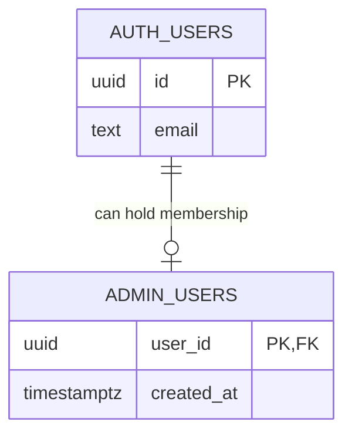

---
tags:
  - RPRT
  - database
  - authorization
  - administrator
  - RLS
  - schema
  - reference
type: schema-reference
---
[[Studio Repertório]]
[[Database Schemas]]
[[Auth Users and Profiles]]

# Administrator Membership Schema

> [!abstract] Authorization Schema
> Administrator access comes from one protected membership table keyed by Supabase Auth identity. It does not come from profiles, user metadata, interface state, or editable claims.

> [!warning] Source Of Truth
> The repository migration, pgTAP tests, and `docs/database.md` are authoritative.

## <span style="color:rgb(112, 48, 160)">Schema Boundary</span>

| Object | Purpose |
|---|---|
| `public.admin_users` | Stores one administrator-membership row per Auth user |
| `public.is_admin()` | Checks the current authenticated user's protected membership |

The membership row stores no name, email, personal data, role label, or permission list.

## <span style="color:rgb(0, 176, 240)">Relationship Model</span>



## <span style="color:rgb(0, 112, 192)">Table Schema</span>

| Column | Type | Rule |
|---|---|---|
| `user_id` | `uuid` | Primary key and foreign key to `auth.users.id` |
| `created_at` | `timestamptz` | Required; database-authored with `statement_timestamp()` |

Relationship rules:

- One Auth user has zero or one administrator membership.
- Auth user ID updates are restricted.
- Deleting an Auth user removes stale membership through `on delete cascade`.
- The table has RLS enabled and no application-role policies.

## <span style="color:rgb(0, 176, 80)">Protected Membership Check</span>

```sql
public.is_admin() returns boolean
```

The function:

- Derives identity from `auth.uid()`.
- Returns true only when the current user has an `admin_users` row.
- Uses `stable`, `security definer`, and an empty fixed `search_path`.
- Schema-qualifies the protected table.
- Grants execution only to `authenticated`.

A caller cannot supply another user ID to the function.

## <span style="color:rgb(192, 0, 0)">Access Control</span>

| Actor | Direct table access | Execute `is_admin()` |
|---|:---:|:---:|
| `PUBLIC` | Denied | Denied |
| Anonymous | Denied | Denied |
| Authenticated customer | Denied | Allowed; returns false |
| Authenticated administrator | Denied | Allowed; returns true |
| `service_role` | Denied | Denied |

> [!danger] Authorization Rule
> Do not use `profiles`, `raw_user_meta_data`, browser state, or interface visibility as administrator authorization evidence.

## <span style="color:rgb(255, 192, 0)">Membership Lifecycle</span>

Application roles cannot add, update, or remove membership rows directly.

The first membership is environment-specific authorization data. An approved database operator adds it in a reviewed SQL session after the intended Auth user and target environment are confirmed:

```sql
begin;

insert into public.admin_users (user_id)
values ('<approved-auth-user-id>'::uuid)
on conflict (user_id) do nothing;

commit;
```

Do not place real user IDs, emails, or membership rows in migrations, seed data, logs, notes, or evidence. Future administrator-management flows must use separate guarded and audited commands.

## <span style="color:rgb(0, 112, 192)">Repository Sources</span>

- `supabase/migrations/20260818175729_establish_administrator_membership_schema_security.sql`
- `supabase/tests/admin_membership.test.sql`
- `docs/database.md`

> [!summary] Core Rule
> `admin_users` is the only administrator-membership source, and `is_admin()` is the protected application check.
