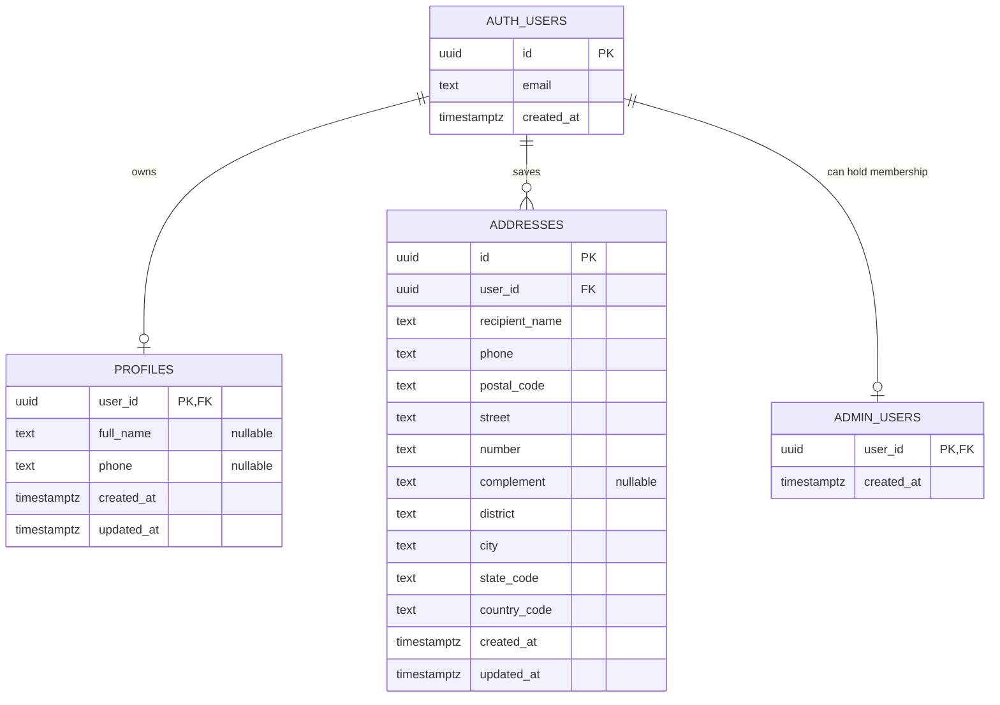
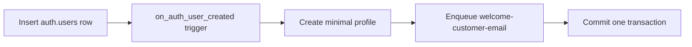

---
tags:
  - RPRT
  - database
  - identity
  - auth
  - profiles
  - addresses
  - RLS
  - schema
  - reference
type: schema-reference
---
[[Studio Repertório]]
[[Database Schemas]]
[[Administrator Membership Schema]]

# Auth Users, Profiles, and Addresses

> [!abstract] Identity Schema
> Supabase Auth owns login identity. Repertório stores customer profile data and saved Brazilian delivery addresses in application tables with owner-only access.

> [!warning] Source Of Truth
> The repository migrations, pgTAP tests, and `docs/database.md` are authoritative.

> [!example] Visual Explainer
> [[Visual Explainers/RPRT-47 Identity Schema Visual Explainer.html|Open the local identity schema visual explainer]]

## Schema Boundary

| Object | Owner | Purpose |
|---|---|---|
| `auth.users` | Supabase Auth | Login identity, email, providers, and authentication state |
| `public.profiles` | Repertório | Optional customer display name and canonical mobile phone |
| `public.addresses` | Repertório | Mutable saved Brazilian delivery addresses |
| `public.admin_users` | Repertório | Administrator membership; see [[Administrator Membership Schema]] |

Login email stays in `auth.users`. Profiles do not store email, CPF, passwords, provider identity, or authorization roles.

## Relationship Model

## Profiles

`public.profiles.user_id` is both the primary key and a foreign key to `auth.users.id`.

| Column | Type | Rule |
|---|---|---|
| `user_id` | `uuid` | Required; one profile per Auth user; client cannot change it |
| `full_name` | `text` | Optional; trimmed; 1 to 200 characters when present |
| `phone` | `text` | Optional; canonical Brazilian mobile number in `+55...` format |
| `created_at` | `timestamptz` | Required; database-authored; client cannot change it |
| `updated_at` | `timestamptz` | Required; database-authored and advanced by trigger |

Authenticated owners can read their profile and update only `full_name` and `phone`. They cannot insert or delete a profile directly.

## Addresses

`public.addresses` supports many saved addresses for one Auth user.

| Field group | Columns | Rule |
|---|---|---|
| Identity | `id`, `user_id` | Database UUID and immutable Auth owner |
| Recipient | `recipient_name`, `phone` | Trimmed recipient name and canonical Brazilian mobile phone |
| Location | `postal_code`, `street`, `number`, `complement`, `district`, `city` | Brazilian delivery address with length and format checks |
| Region | `state_code`, `country_code` | Two uppercase state letters; country is fixed to `BR` |
| Time | `created_at`, `updated_at` | Database-authored timestamps |

Important constraints:

- `postal_code` contains exactly eight digits.
- `state_code` contains exactly two uppercase letters.
- `country_code` is always `BR`.
- Required text is trimmed and non-empty.
- `complement` is null or a trimmed value of at most 100 characters.
- `addresses_user_id_idx` supports owner lookups.

Authenticated owners can create, read, update, and delete only their own addresses. Column grants prevent changes to address identity, ownership, country, and timestamps.

## Auth Initialization

`private.handle_new_auth_user()` runs after an Auth user is inserted. In the same transaction, it:

1. Creates one minimal profile with database-authored time.
2. Enqueues one idempotent `welcome-customer-email` outbox job.
3. Uses the profile identity and normalized creation time as durable evidence.

The function ignores user metadata, uses `security definer` with an empty fixed `search_path`, and has no application-role execute grant. A profile or outbox failure rolls back Auth-user creation.

`private.set_updated_at()` supplies `updated_at` for profile and address changes. Application roles cannot execute it directly.

## Access Control

| Actor | Profiles | Addresses |
|---|---|---|
| Anonymous | No direct access | No direct access |
| Authenticated owner | Read own row; update `full_name` and `phone` | Create, read, update, and delete own rows |
| Authenticated other user | No access | No access |
| Administrator | No wider access than row ownership | No wider access than row ownership |
| `service_role` | No direct table grant | No direct table grant |

Both application tables have RLS enabled. Ownership uses `(select auth.uid()) = user_id`. Update policies use both `using` and `with check`.

## Deletion And Retention

- Auth user ID updates are restricted.
- Deleting an Auth user cascades to its profile and saved addresses.
- Saved addresses are mutable account data, not order history.
- Orders keep separate immutable contact and shipping snapshots.
- Guest order access belongs to the order schema, not the identity schema.

## Repository Sources

- `supabase/migrations/20260819205344_add_identity_access_schema.sql`
- `supabase/tests/identity_access.test.sql`
- `docs/database.md`

> [!summary] Core Rule
> Supabase Auth owns login identity. Repertório stores only application profile and address data, and RLS limits each customer to their own rows.
