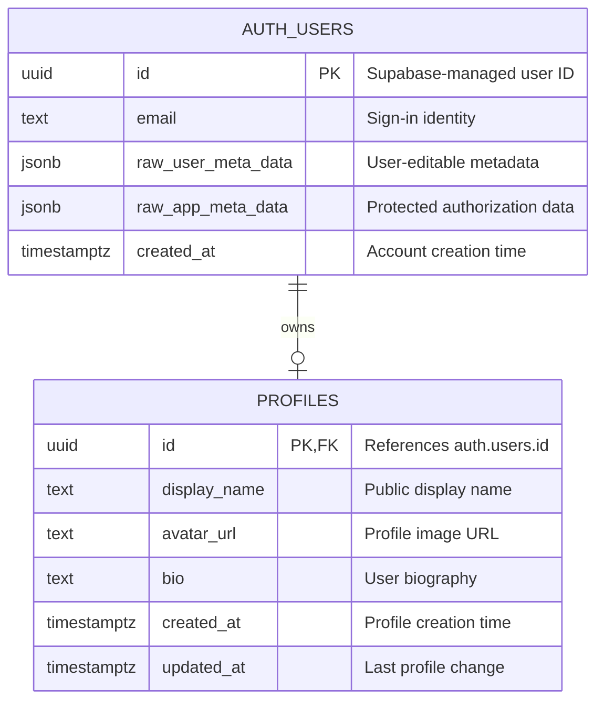

[[Studio Repertório]]

> [!abstract] Auth Users and Profiles
> `auth.users` manages identity and sign-in. `public.profiles` stores application data about the user.

> [!warning] Example Only
> This note shows a generic Supabase design example. It does not represent the implemented Repertório schema. The repository migrations and `docs/database.md` are the source of truth.

## <span style="color:rgb(112, 48, 160)">Why Separate Them?</span>

| Table | Owner | Purpose | API access |
|---|---|---|---|
| `auth.users` | Supabase | Identity, email, password, providers, and sign-in state | Not exposed through the normal Data API |
| `public.profiles` | Application | Display name, avatar, biography, and preferences | Available through the Data API when grants and RLS permit access |

This separation:

- Protects sensitive authentication data.
- Keeps the application schema stable.
- Lets profile fields change without changing authentication.
- Gives the application direct control of grants and Row Level Security (RLS).

> [!warning] Managed Schema
> Do not change the structure of `auth.users`. Supabase manages its internal columns, indexes, and constraints.

## <span style="color:rgb(0, 176, 240)">Relationship</span>

<mark style="background: #ADCCFFA6;">One Auth user can have zero or one profile.</mark>

`profiles.id` is both its primary key and a foreign key to `auth.users.id`. This design:

- Prevents a profile without an Auth user.
- Prevents more than one profile for the same user.
- Removes the profile when its Auth user is deleted through `on delete cascade`.

## <span style="color:rgb(0, 176, 80)">Database Diagram</span>



> [!info] Referential Action
> `public.profiles.id` references `auth.users.id` with `on delete cascade`. Deleting an Auth user also deletes the related profile.

## <span style="color:rgb(255, 192, 0)">Access Control</span>

Use RLS policies with this ownership check:

```sql
(select auth.uid()) = id
```

This check lets a signed-in user access only the profile with the same UUID.

> [!danger] Authorization Rule
> Do not use user-editable `user_metadata` for roles or permissions. Use protected application tables or `app_metadata` for authorization data.

## <span style="color:rgb(112, 48, 160)">Core Principle</span>

> [!success]
> Keep authentication data in the Supabase-managed `auth` schema. Keep application data in application-owned tables protected by grants and RLS.

## <span style="color:rgb(0, 176, 240)">Sources</span>

- [Supabase User Management](https://supabase.com/docs/guides/auth/managing-user-data)
- [Supabase Row Level Security](https://supabase.com/docs/guides/database/postgres/row-level-security)
