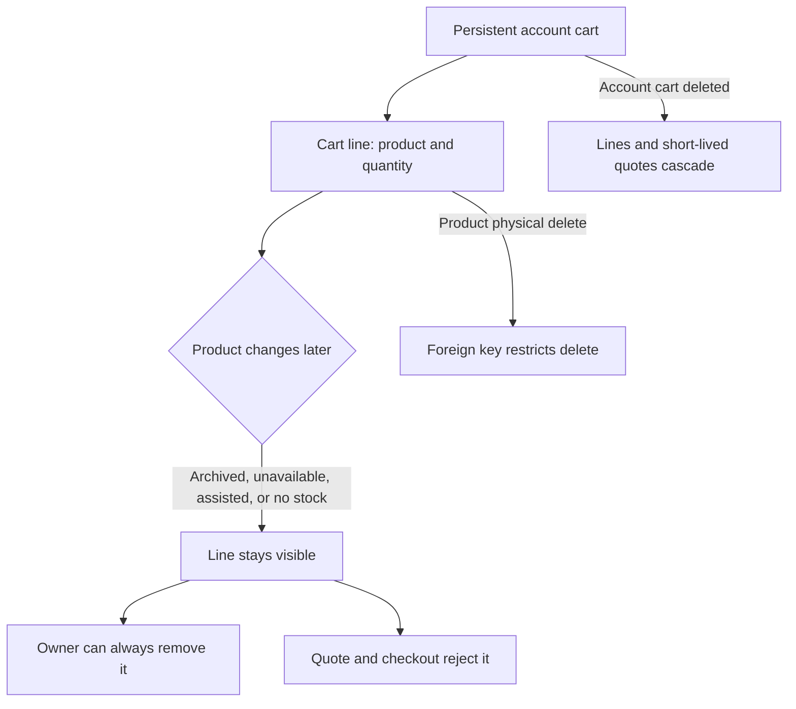

[RPRT-49: Implement cart quote and coupon schema security](https://linear.app/guisaliba/issue/RPRT-49/implement-cart-quote-and-coupon-schema-security)

> [!abstract] Security boundary
> The browser sends cart intent. PostgreSQL owns price, stock, shipping, discount, totals, expiry, and consumption truth.

## Result

| Contract | Result |
| --- | --- |
| Public tables | `carts`, `cart_items`, `shipping_quotes`, `coupons` |
| Focused database assertions | 216 passed |
| Committed race proofs | 6 passed |
| Cart policy | One non-expiring cart per authenticated account |
| Guest policy | Browser-local cart; only protected quote evidence is stored |

## Guest Quote Flow

The protected quote binds the exact cart, destination, current resolved package data, parcel, provider, amount, and expiry evidence. Its finite validity is at most twenty-four hours. A changed, expired, mismatched, or reused quote fails.

## Cart Lifecycle

- A cart line stores no price and reserves no stock.
- Product status updates do not trigger the product foreign key.
- The line alone does not permanently block a direct-to-assisted sales-mode change.
- Owner removal checks ownership only, so a stale line never traps the customer.

## Authority Boundary

| Browser can request | PostgreSQL must prove |
| --- | --- |
| Product and quantity | Current product status and stock |
| Destination CEP | Exact normalized destination |
| Coupon code | Validity, minimum subtotal, and global use limit |
| Opaque quote ID | Exact hashes, amount, provider, expiry, and unused state |

## Lock Order

Quote recording locks `cart` -> `products by UUID`. Evidence consumption locks `cart` -> `quote` -> `coupon`.

M3 order creation will extend this order with the remaining catalog and reservation locks. The current order gives deterministic outcomes for cart mutation, quote recording, quote consumption, and coupon-limit races.

## Concurrency Evidence

| Race | Proven result |
| --- | --- |
| Concurrent cart creation | Both sessions return one cart UUID |
| Concurrent quote use | One session consumes; one rejects |
| Final coupon use | One use commits; the losing quote stays unused |
| Cart mutation during consumption | Consume-before-mutate or stale evidence rejection |
| Quote expires while waiting | The post-lock clock rejects it |
| Quote recording expires while waiting | No expired quote row is stored |

## Verification

Passed: migration reset, database lint, 216 focused database assertions, architecture sync and drift check, format, ESLint, TypeScript, 39 unit tests, and production build.

The full database suite keeps one unrelated baseline failure in `outbox_replay.test.sql`: `service_role` does not have direct `SELECT` access to `outbox_jobs`. This same failure exists on clean `origin/dev`.