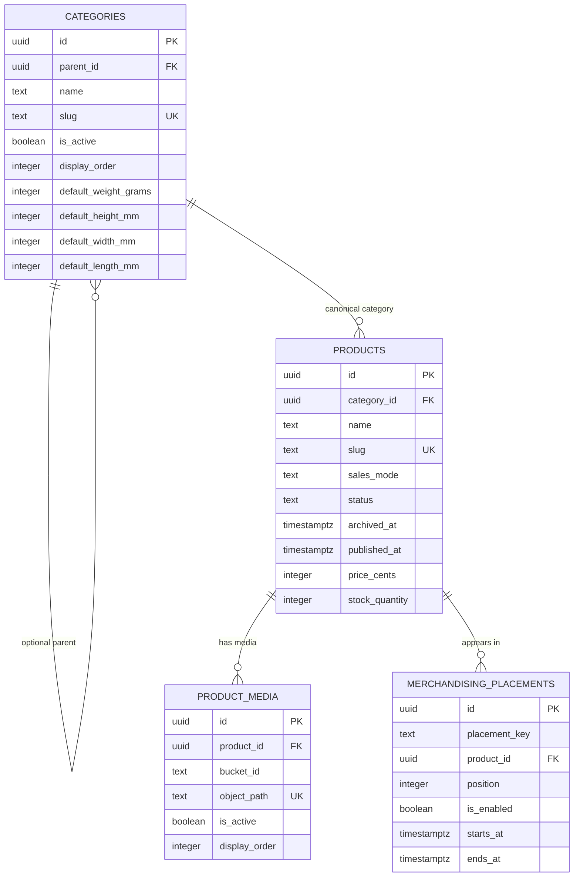
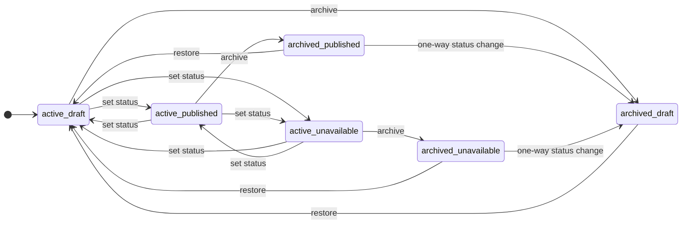
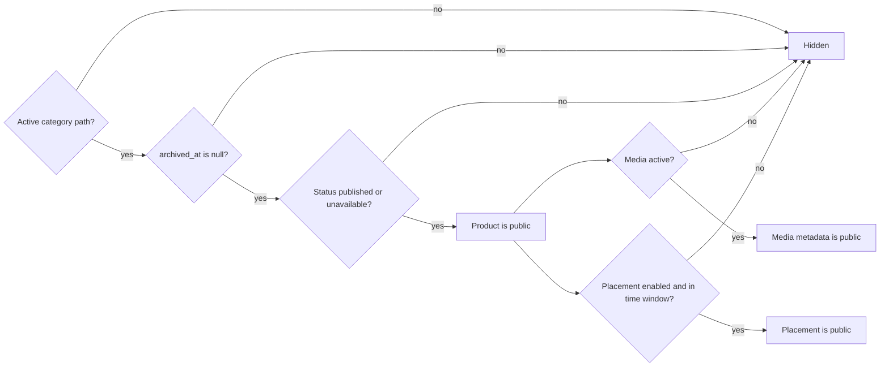

---
tags:
  - RPRT
  - catalog
  - product
  - category
  - product-status
  - product-archival
  - slug
  - database
  - reference
type: schema-reference
---
[[Studio Repertório]]
[[Database Schemas]]
[[Product Media Storage]]

# Catalog, Products, Categories, and Archival

> [!abstract] Catalog Schema
> This note describes the Repertório catalog tables, relationships, sales modes, product state, archival, media, merchandising, stock, package defaults, security, concurrency, and audit boundaries.

> [!info] Schema Contract
> Catalog identity, public visibility, mutable presentation data, guarded lifecycle commands, and immutable transition evidence remain separate concerns.

> [!warning] Source Of Truth
> The repository migrations, tests, `docs/database.md`, Technical Architecture, and Lifecycle Diagrams are authoritative.

> [!example] Visual Explainer
> [[Visual Explainers/RPRT-50 Catalog Authority Visual Explainer.html|Open the local catalog schema visual explainer]]

## Catalog Boundary

M1 owns four relational catalog tables.

| Table | Purpose | Public rule |
|---|---|---|
| `public.categories` | Category hierarchy, navigation order, activation, and package defaults | The complete category path must be active. |
| `public.products` | Product identity, content, sales mode, status, retention, price, stock, package override, and SEO | Product must be active, in a public status, and under an active category path. |
| `public.product_media` | Product-bound media identity and presentation metadata | Media row must be active and its product must be public. |
| `public.merchandising_placements` | Named, ordered, timed product curation | Placement must be enabled, inside its optional time window, and attached to a public product. |

Excluded from this M1 boundary:

- Posts and newsletter capture.
- Storage bucket and object policies.
- Category seed content.
- Admin screens and upload helpers.
- Full-text search and cache implementation.
- Cart, order, payment, reservation, and fulfillment tables.

## Relationship Model

## Categories

### Hierarchy

- A category is a root or one child under a root.
- The model permits two levels only.
- A category cannot parent itself.
- A child cannot have another child.
- `parent_id` is immutable after insertion.
- A wrong parent requires a controlled replacement or migration operation.
- The application has no normal delete-and-recreate correction path.

### Activation

Category activation is a bulk visibility switch.

- Deactivation hides the category and its public catalog subtree.
- Deactivation does not rewrite product status or `archived_at`.
- Reactivation can restore eligible products without another product transition.
- Archived product dependencies do not block category deactivation, reactivation, or package-default changes.

### Package Defaults

Category shipping values are optional reusable defaults. They do not mean that all products in a category have equal dimensions or weight.

A package bundle contains:

- Weight in grams.
- Height in millimeters.
- Width in millimeters.
- Length in millimeters.

Rules:

- A package bundle is complete or absent.
- A complete product override has first priority.
- A complete category default is the fallback.
- A public direct-stocked product must resolve one complete bundle.
- A public direct-stocked product cannot lose its only usable package.
- Assisted products do not use catalog package, price, or stock fields.
- Carrier-specific shipping validation remains deferred.

## Products

A product has one canonical category and one global product slug.

Core product data includes:

- Name and Markdown description.
- Canonical category.
- Sales mode.
- Product status.
- Reversible archive time.
- First-publication time.
- SEO title and description.
- Direct price and available stock when applicable.
- Optional complete package override for direct-stocked products.
- Database-authored creation and update times.

Product variants are not part of the MVP.

## Sales Modes

| Rule | `direct_stocked` | `assisted` |
|---|---|---|
| Catalog price | Required, positive integer cents | Must be null |
| Available stock | Required, non-negative integer | Must be null |
| Product package override | Complete bundle or inherited category default | Must be absent |
| Storefront cart | Allowed when product is eligible | Not allowed |
| Purchase flow | Direct checkout | Staff negotiation and assisted draft |
| Final price | Catalog snapshot | Negotiated order-item snapshot |
| Reservation | Required for direct order flow | Not used |

The MVP does not mix direct-stocked and assisted products in one order.

Sales mode can change only while an active product is a draft. The guarded command changes all dependent fields atomically.

## Product Status

The only product statuses are:

| Status | Catalog meaning | Purchase meaning |
|---|---|---|
| `draft` | Hidden | Not eligible |
| `published` | Public when all visibility rules pass | Can be eligible when sales-mode rules also pass |
| `unavailable` | Public when all visibility rules pass | Not eligible for normal direct checkout |

Important distinctions:

- Status is not archival.
- Status is not stock.
- Status is not category activation.
- Status is not media activation.
- Status is not placement enablement.
- Zero stock does not rewrite status.

`published_at` records the first real public activation. A transition to `published` or `unavailable` sets it only when it is null. Later status, archive, and restore operations preserve it.

## Status And Retention Matrix

Archival is an independent nullable `products.archived_at` value. All six stored combinations are valid.

| Status | Active retention | Archived retention |
|---|---|---|
| `draft` | Hidden and editable | Hidden and frozen |
| `published` | Public when valid | Hidden and frozen; status can move one way to draft |
| `unavailable` | Public when valid | Hidden and frozen; status can move one way to draft |

## Archival Contract

Archive is reversible catalog retention. It is not a fourth status, stock state, hard delete, or media-confidentiality control.

### Archive Preserves

- Product row and primary key.
- Current product status.
- Name, description, category assignment, and SEO content.
- Price, stock, sales mode, and package data.
- Media rows and media active state.
- First-publication time.
- Product slug.
- Immutable transition history.

### Archive Changes

- Sets database-authored `archived_at`.
- Removes the product from public relational catalog reads.
- Hides dependent media and placement rows through product visibility.
- Atomically disables all enabled merchandising placements.
- Freezes product and related catalog mutation.

### Frozen While Archived

Administrators cannot change:

- Product content.
- Category assignment.
- Stock.
- Sales mode.
- Media rows.
- Placement rows.

Allowed operations are:

- An unchanged status retry.
- A one-way status change from `published` or `unavailable` to `draft`.
- Restore.

An archived draft cannot enter `published` or `unavailable`.

### Restore

Restore:

- Clears `archived_at`.
- Always sets product status to `draft`.
- Preserves `published_at`.
- Preserves media active state.
- Does not enable placements.
- Does not run public-state validation.

A later explicit publication runs active-category and resolved-package validation.

### No Purge

- Application roles have no product hard-delete path.
- M1 has no product purge command.
- Archived rows keep their slugs reserved.
- A future retention decision must define purge authority, retention time, Storage effects, and audit evidence.

## Slugs And Identity

### Category Slugs

- Category slugs are unique in the category table.
- Category activation does not release a slug.
- Parent changes do not provide a normal rename or move shortcut.

### Product Slugs

- Product slugs are unique in the product table.
- A draft reserves its slug.
- An unavailable product reserves its slug.
- An archived product reserves its slug.
- Restore keeps the same slug.
- M1 has no automatic slug reuse.

### Media Identity

- Media object identity is product-bound and immutable through application updates.
- The fixed relational bucket identifier is `product-media`.
- Object path, MIME metadata, byte size, and image dimensions define the stored media identity.
- Alt text, display order, and active state are presentation fields.

## Public Visibility

Catalog visibility is a composed read rule. It is not a lifecycle transition.

A known public Storage URL or cached object can remain accessible after archive or media deactivation. Database RLS hides catalog rows; it does not revoke a public object URL. RPRT-10 owns Storage bucket and object policy.

## Stock And Availability

`stock_quantity` means currently available direct-stocked units.

- Stock cannot be negative.
- Assisted products have no stock quantity.
- Zero stock does not archive a product.
- Zero stock does not rewrite publication status.
- An otherwise public zero-stock product remains in the catalog.
- The storefront derives an `Unavailable` presentation and disables purchase action.
- A future interface can offer a stock-notification action.
- The guarded stock command uses an expected quantity to reject stale edits.
- Reservation and checkout commands remain the authority for later stock consumption and release.

## Media

`product_media` keeps relational metadata for an immutable Storage object identity.

Archive and media deactivation are different:

| Action | Media row | Active flag | Storage object | Public catalog metadata |
|---|---|---|---|---|
| Archive product | Kept | Preserved | Kept | Hidden |
| Deactivate media | Kept | Set false | Kept | Hidden |
| Restore product to draft | Kept | Preserved | Kept | Hidden because product is draft |
| Republish restored product | Kept | Preserved | Kept | Active media can return |
| Delete Storage object | Separate explicit intent | Contract depends on later workflow | Deleted by Storage workflow | Outside RPRT-50 |

Storage deletion and object lifecycle remain separate work for RPRT-10 and later M2 media workflows.

## Merchandising Placements

A placement contains:

- Placement key.
- Product reference.
- Position.
- Enabled state.
- Optional start time.
- Optional end time.

A placement is public only when:

- It is enabled.
- Its product is public.
- Its start time is absent or reached.
- Its end time is absent or not reached.

Archive disables enabled placements in the same guarded transaction. Restore never enables them. An administrator must review and enable placement intent again after restore and publication.

## Guarded Commands

| Command | Authority | Main control | Audit |
|---|---|---|---|
| `set_available_stock` | Administrator | Product row lock and expected quantity | Immutable product transition |
| `set_product_status` | Administrator | Product row lock, expected status, publication validation, and archive rule | Immutable status transition |
| `set_product_sales_mode` | Administrator | Draft-only product row lock and atomic dependent-field update | Immutable sales-mode transition |
| `set_product_archived` | Administrator | Catalog-relation guard, product row lock, and expected `updated_at` | Immutable active/archive transition |

Application roles cannot directly update stock, status, archive time, sales mode, primary keys, database timestamps, or media object identity.

## Concurrency And Retry

### Archive And Restore Retry

`set_product_archived(product_id, expected_updated_at, archived)` returns:

- `applied`.
- Current `archived` state.
- Current product `updated_at`.

Rules:

- The command locks the product before it compares state.
- The supplied timestamp must equal the current `products.updated_at`.
- Any intervening product mutation makes the request stale.
- An active to archived to active ABA cycle also makes the old request stale.
- A stale request writes nothing and returns `applied = false` with current state.
- A current same-state retry is an exact no-op.

### Lock Order

Two transaction advisory protocols protect catalog correctness.

| Guard | Purpose |
|---|---|
| Category publication guard | Serializes product publication with category package-default removal. |
| Catalog-relation guard | Serializes archive with media and placement writes before product locks. |

A future command that mixes product and related-row writes must take the catalog-relation guard before it locks a product.

## RLS And Grants

- All four catalog tables use Row Level Security.
- Public roles receive read access only through visibility policies.
- Authenticated administrators use `public.is_admin()` for approved writes.
- Archived products stay visible to administrators for review but are excluded from ordinary updates.
- Media and placement insert or update policies lock and recheck the active product.
- Security-definer commands use a fixed empty `search_path` and narrow execute grants.
- Application roles receive no catalog delete grant.
- Service-role callers receive no direct catalog table grant in this contract.

## Audit Evidence

Successful guarded mutations write immutable `public.domain_transitions` records with:

- Aggregate type and product ID.
- Previous and next state.
- Administrator actor ID.
- Command source.
- Reason.
- Operation reference.
- Database timestamp.

Rejected, stale, denied, and no-op operations do not write false transition evidence.

## Dependent Commerce Rules

RPRT-50 defines these future command guards but does not implement commerce tables.

| Flow | Archived-product behavior |
|---|---|
| New direct order | Reject before reservation or payment work starts. |
| Existing cart line | Keep the line. Block checkout until removal or valid active eligibility. |
| New assisted issuance | Reject while any referenced product is archived or otherwise ineligible. |
| Existing assisted draft | Keep the draft. Do not issue it while blocked. |
| Active reservation | Continue its normal consume or release lifecycle. |
| Pending payment | Continue verified reconciliation. |
| Late payment | Continue approved recovery rules. |
| Placed order | Continue from immutable commercial snapshots. |
| Fulfillment | Continue from settlement and fulfillment authority, not current catalog state. |

Current and future purchase commands must treat status, archive state, sales mode, and stock as separate guards.

## Ownership And Deferred Work

| Work | Owner |
|---|---|
| Relational catalog and archival contract | RPRT-50 |
| Storage bucket and object policies | RPRT-10 |
| Category seed content | RPRT-11 |
| Cart and quote schema | RPRT-49 |
| Order and settlement schema | RPRT-46 |
| Admin screens, uploads, caching, and search | M2 catalog work |
| Product or media purge | Future retention decision |

## Verification Evidence

| Gate | Result |
|---|:---:|
| Catalog pgTAP | 189 / 189 passed |
| Committed-session catalog concurrency pgTAP | 23 / 23 passed |
| Combined catalog contract | 212 / 212 passed |
| Unit tests | 39 / 39 passed |
| Database lint | Passed |
| Format, TypeScript, and ESLint | Passed |
| Production build | Passed |
| Architecture freshness | Passed locally and remotely |
| Independent final reviews | No findings |

Known unrelated conditions:

- Full database verification reaches the unchanged `outbox_replay.test.sql` service-role permission failure.
- Vercel reports the known Git-author project-access block.

## Operational Checklist

### Before Publication

- Confirm product status is draft.
- Confirm the complete category path is active.
- Confirm sales-mode fields are valid.
- Confirm a direct product resolves a complete package.
- Confirm media and merchandising intent.

### Before Archive

- Load the current product `updated_at`.
- Confirm archive intent and affected placements.
- Call the guarded archive command.
- Use the returned state and update time as current truth.

### After Restore

- Expect active draft state.
- Review product content, category, stock, sales mode, and media.
- Review placements because they remain disabled.
- Publish explicitly only after all public rules pass.

## References

- [RPRT-50 Linear issue](https://linear.app/guisaliba/issue/RPRT-50/implement-catalog-and-content-schema-security)
- [Technical Architecture](https://linear.app/guisaliba/document/technical-architecture-487c0e8e7e8d)
- [Lifecycle Diagrams](https://linear.app/guisaliba/document/lifecycle-diagrams-7784b41c07ee)
- [PR #19](https://github.com/guisaliba/repertorio/pull/19)
- [`7b55cfb` architecture clarification](https://github.com/guisaliba/repertorio/commit/7b55cfb)
- [`b266b21` final archival contract](https://github.com/guisaliba/repertorio/commit/b266b21)
- [[RPRT-50 - Catalog Authority and Product Status]]

> [!summary] Core Rule
> Catalog visibility is composed. Product status, archive state, category activation, stock, media activation, and placement enablement stay separate. Archive keeps product identity and history, freezes catalog mutation, disables placements, and restores only to draft.
