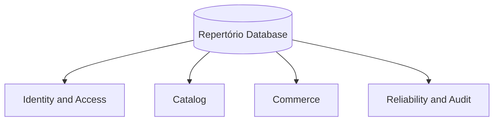

---
aliases:
  - RPRT Database Schemas
  - Database Architecture
tags:
  - RPRT
  - database
  - schema
  - index
type: schema-index
---
[[Studio Repertório|Back to Studio Repertório]]

> [!abstract] Database Schemas
> A focused index of implemented Repertório table models, relationships, constraints, RLS boundaries, and protected database commands.

> [!warning] Source Of Truth
> Repository migrations, database tests, and `docs/database.md` are authoritative.

---

## Schema Map

## Identity And Access

| Schema note | Database objects |
|---|---|
| [[Auth Users and Profiles]] | `auth.users`, `profiles`, `addresses`, Auth initialization triggers |
| [[Administrator Membership Schema]] | `admin_users`, `is_admin()` |

## Catalog

| Schema note | Database objects |
|---|---|
| [[Catalog Products Categories and Archival]] | `categories`, `products`, `product_media`, `merchandising_placements` |
| [[Product Media Storage]] | `storage.buckets`, `storage.objects`, product-media policies, archive guard |

## Commerce

| Schema note | Database objects |
|---|---|
| [[Cart, Quote and Coupons Security]] | `carts`, `cart_items`, `shipping_quotes`, `coupons` |

## Reliability And Audit

| Schema note | Database objects |
|---|---|
| [[Reliability and Audit Schema]] | `webhook_events`, `domain_transitions`, `operational_alerts`, outbox and replay tables |

---

> [!quote] Schema Boundary
> This index contains database schema references only. Delivery plans, issue state, review state, pull-request state, and work logs stay outside these notes.
