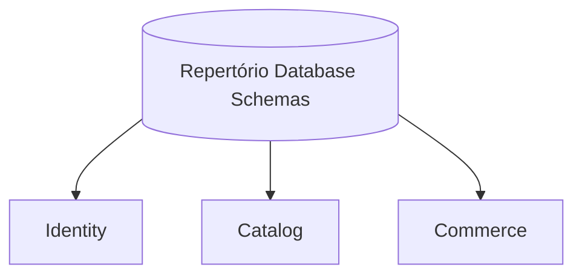

---
aliases:
  - RPRT Database Schemas
  - Database Architecture
tags:
  - RPRT
  - database
  - schema
  - index
type: schema-index
status: Active
---
[[Studio Repertório|Back to Studio Repertório]]

> [!abstract] Database Schemas
> A focused index of notes whose main subject is a database schema, table model, relationship model, or schema security boundary.

> [!warning] Source Of Truth
> Repository migrations, database tests, and `docs/database.md` are authoritative.

---

## Schema Map

## Identity Schema

| Schema note | Tables and relationships | Authority |
|---|---|:---:|
| [[Auth Users and Profiles]] | `auth.users` and `public.profiles` | Example only |

## Catalog Schema

| Schema note | Tables and relationships | Authority |
|---|---|:---:|
| [[Catalog Products Categories and Archival]] | `categories`, `products`, `product_media`, and `merchandising_placements` | Approved reference |

## Commerce Schema

| Schema note | Tables and relationships | Authority |
|---|---|:---:|
| [[Cart, Quote and Coupons Security]] | `carts`, `cart_items`, `shipping_quotes`, and `coupons` | Implemented reference |

---

> [!quote] Schema Boundary
> This index excludes implementation plans, lifecycle contracts, provider-call rules, payment recovery contracts, and general database guidance.
