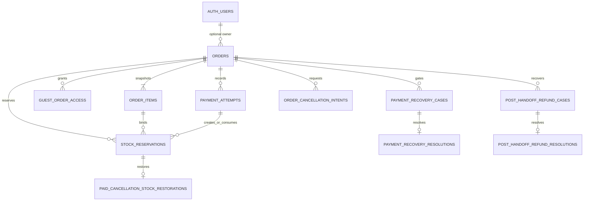

---
tags:
  - RPRT
  - database
  - commerce
  - orders
  - payments
  - settlement
  - stock-reservations
  - fulfillment
  - guest-access
  - RLS
  - schema
  - reference
type: schema-reference
---
[[Studio Repertório]]
[[Database Schemas]]
[[Cart, Quote and Coupons Security]]
[[Catalog Products Categories and Archival]]
[[Opaque Guest Access Token]]
[[RPRT-41 - Payment Recovery Gate Contract]]
[[RPRT-42 - Cancellation Intent and Paid-Stock Recovery Contract]]

# Order and Settlement Security

> [!abstract] Commerce Ledger
> PostgreSQL creates immutable order snapshots, reserves stock, records verified payment truth, selects one settlement authority, controls cancellation and fulfillment, and keeps unsafe outcomes in explicit recovery gates.

> [!warning] Source Of Truth
> The repository migrations, pgTAP tests, and `docs/database.md` are authoritative.

## Schema Boundary

| Object | Purpose |
|---|---|
| `orders` | Order identity, customer and delivery snapshots, totals, lifecycle, and payment pointers |
| `order_items` | Immutable product, package, quantity, price, and line-total snapshots |
| `guest_order_access` | Hash-only one-order guest capability lifecycle |
| `payment_attempts` | One row for each provider checkout attempt and its verified state |
| `webhook_event_subjects` | Immutable binding from one verified commerce event to its exact local subject and provider reference |
| `stock_reservations` | Active, consumed, or released direct-stock evidence |
| `payment_recovery_cases` | Blocking or non-blocking unsafe payment facts |
| `payment_recovery_resolutions` | One immutable resolution for a payment recovery case |
| `order_cancellation_intents` | Durable paid-order cancellation intent |
| `paid_cancellation_stock_restorations` | One approved stock restoration fact per consumed reservation |
| `post_handoff_refund_cases` | Refund recovery after authoritative handoff |
| `post_handoff_refund_resolutions` | One immutable post-handoff recovery resolution |

Provider API calls, webhook signature checks, browser pages, email templates, and JWT signing are outside this database boundary.

## Relationship Model

Auth-user deletion sets `orders.user_id` to null. It does not delete an order. The immutable customer kind, contact, delivery, and commercial snapshots preserve historical truth.

## Order Authority

- `create_order` derives the account or verified guest actor.
- Storefront and assisted creation serialize on a domain-separated idempotency lock before the first lookup. An exact retry returns the same order, and a conflicting retry fails.
- It rechecks cart ownership, current catalog state, price, package, stock, quote, and coupon evidence.
- It freezes order and item snapshots, consumes checkout evidence, reserves stock, creates the first payment attempt, writes transitions, and enqueues durable work in one transaction.
- `create_assisted_draft` stores negotiated snapshots but creates no stock reservation.
- `issue_assisted_order` rechecks assisted-product eligibility and creates payment and issuance work.
- Storefront orders start as `placed`. Assisted orders start as `draft` and become `placed` only through the guarded issue command.
- Direct writes cannot change protected snapshots, identity, ownership, totals, pointers, or database times.

## Stock Rules

`products.stock_quantity` is available stock.

| Operation | Reservation state | Available stock effect |
|---|---|---|
| Reserve | `active` | Decrement once |
| Safe settlement | `consumed` | No second decrement |
| Verified non-payable release | `released` | Increment once |
| Approved paid-cancellation restoration | Consumed history stays immutable | Increment once with one restoration fact |
| Late-paid recovery | New consumed reservation or safe reacquisition | All required lines succeed or none do |

Products lock in stable UUID order. Reservations lock in stable reservation-ID order. A final-stock race cannot oversell.

## Payment And Settlement

Each retry creates a new `payment_attempts` row. These states remain payable because they can still produce verified payment:

- `not_started`
- `creating`
- `creation_unknown`
- `pending`

Only one payable attempt can exist for an order at one time, and an open blocking recovery gate prevents a new attempt. Retry creation, the `creating` transition, stock reservation, and durable session work commit atomically. `record_payment_attempt_session` is the only command that can store successful session identity, move the attempt to `pending`, and align active reservation expiry. `mark_payment_attempt_creation_unknown` records an ambiguous create result and blocks a blind retry. An untouched `not_started` attempt can be replaced only through audited proof that no provider call occurred.

`record_commerce_webhook_event` binds verified payment or fulfillment evidence to one exact local subject and immutable provider reference. A later command rejects same-provider evidence that targets a different payment attempt or order. Normalized payment facts compare all immutable provider IDs, amount, currency, state, status, source, and target before an exact retry is accepted.

Multiple `paid` attempts stay visible. `current_payment_attempt_id` selects retry work but gives no fulfillment authority. Only `settlement_payment_attempt_id` gives settlement authority, and only when it points to a same-order verified paid attempt with no blocking recovery gate.

A refund or cancellation does not erase the settlement pointer. Historical payment authority remains inspectable.

## Recovery And Cancellation

- Verified provider truth is stored before a settlement or refund decision.
- The earliest committed paid transition wins, with payment-attempt ID as the tie-breaker.
- Duplicate or late paid truth is not overwritten. Deterministically later paid truth becomes non-blocking full-refund work, while fully refunded history does not block a later valid settlement.
- Recovery supersedes only untouched `not_started` competitors, with immutable no-call evidence.
- Unsafe settlement opens an immutable payment recovery case with an order-attempt-transition business key.
- A blocking case stops fulfillment until a guarded resolution closes the gate.
- Administrative closure requires an authenticated administrator, written reason, proof reference, and idempotency key.
- Paid cancellation locks matching shipping-label work. It can safely complete only an unclaimed label with no provider-call evidence; processing, completed, dead-letter, or provider-evidenced labels reject cancellation.
- Paid cancellation first stores intent. It does not pretend that payment did not happen.
- Verified full-refund evidence can restore eligible stock before authoritative handoff.
- After handoff, delivery truth remains authoritative. An unexpected verified refund can move the payment to `refunded`, preserve fulfillment truth, and use a separate post-handoff recovery case.
- Database validators require each recovery, cancellation, restoration, and resolution fact to match its exact order, payment, reservation, and transition relationships.

## Fulfillment Gates

Forward fulfillment commands require:

- One accepted settlement pointer.
- No active paid-cancellation intent.
- No open blocking payment recovery gate.
- A valid current fulfillment edge.

The guarded commands cover production, readiness, label request, carrier transit, local or pickup handoff, verified fulfillment events, and completion. Fulfillment evidence must match the order shipping provider. Provider-specific status and tracking-reference mapping remains in a later trusted adapter.

## Guest Access

1. PostgreSQL generates an opaque capability with at least 256 bits of entropy.
2. The database stores only its SHA-256 hash and a finite expiry.
3. The trusted server supplies a separate random exchange key from a secure same-site HttpOnly cookie.
4. The first valid exchange stores only the exchange-key hash and returns access ID, order ID, and maximum session expiry.
5. A retry with the same capability and exchange key is idempotent.
6. A different exchange key after exchange is replay and fails.
7. Revocation or replacement invalidates existing access immediately through RLS.

The restricted JWT uses the no-login `guest_order` database role, `sub = guest_order_access.id`, and `rprt_session_kind = guest_order`. RLS derives the order from the access row and rechecks exchange, expiry, revocation, and replacement. It does not trust a caller-supplied order ID.

PostgreSQL does not sign JWTs. A later trusted server route must import an asymmetric Supabase signing key and own secure cookie flags. No signing key, raw capability, or raw exchange key belongs in the repository, database, logs, or query strings.

## RLS And Grants

- Account owners can read only their own orders, items, and narrow payment status.
- Verified guests can read only the order derived from their active guest-access row.
- Customer and guest reads do not expose provider IDs, raw provider status, recovery proof, capability hashes, or internal reasons.
- Authorized staff use protected commands and approved operational reads.
- Workers receive narrow command execution, not broad table mutation.
- Security-definer functions use an empty fixed `search_path` and exact execute grants.
- Protected evidence tables reject direct application-role insert, update, and delete.

## Lock Order

Commands extend the checkout lock protocol in this reviewed order:

`authenticated cart` -> `order` -> `payment attempts` -> `recovery cases` -> `products by UUID` -> `reservations by UUID` -> `shipping quote` -> `coupon`

Each command rechecks its guards after it holds the required locks.

## Concurrency Evidence

| Race | Proven result |
|---|---|
| Final stock | One safe reservation; no oversell |
| Active payment attempt | At most one payable attempt |
| Duplicate paid delivery | One settlement authority; duplicate truth stays visible |
| Settlement versus release | No double stock effect or false authority |
| Recovery resolutions | One valid immutable resolution |
| Cancellation versus handoff | Cancellation-first and handoff-first each produce one valid lifecycle result with preserved evidence |
| Cancellation versus label claim | Cancellation-first safely suppresses an unclaimed label; claim-first rejects cancellation |
| Commerce event versus settlement | Canonical order-first locking prevents a deadlock and preserves exact subject evidence |
| Refund versus handoff | Each committed winner preserves valid settlement and fulfillment evidence |
| Refund and restoration retry | One refund effect and one restoration fact |
| Guest exchange versus replacement | Old access cannot remain valid after replacement |
| Guest exchange versus revocation | Revoked access cannot remain valid |

The committed-session pgTAP suite uses separate `dblink` sessions, finite waits, deterministic fixtures, and complete cleanup.

## Durable Effects

Order, payment, cancellation, and fulfillment commands reuse the approved outbox policy and stable business keys. They can enqueue order email, payment session, payment approval, payment recovery, full refund, assisted-order email, shipping label, and tracking email work. A business transaction and its approved outbox work commit together.

## Repository Sources

- `supabase/migrations/20260823204718_add_order_snapshot_schema.sql`
- `supabase/migrations/20260823205154_add_guest_order_access_schema.sql`
- `supabase/migrations/20260823205528_add_payment_attempt_schema.sql`
- `supabase/migrations/20260823205830_add_stock_reservation_schema.sql`
- `supabase/migrations/20260823210148_add_payment_recovery_schema.sql`
- `supabase/migrations/20260823210449_add_cancellation_recovery_schema.sql`
- `supabase/migrations/20260823210912_add_guest_order_access_commands.sql`
- `supabase/migrations/20260823210921_add_payment_settlement_commands.sql`
- `supabase/migrations/20260823210928_add_order_creation_commands.sql`
- `supabase/migrations/20260823210935_add_cancellation_fulfillment_commands.sql`
- `supabase/tests/order_settlement_concurrency.test.sql`
- `supabase/tests/cancellation_label_concurrency.test.sql`
- `supabase/tests/commerce_webhook_subject_binding.test.sql`

## Verification

| Gate | Result |
|---|:---:|
| RPRT-46 focused pgTAP | 609 / 609 passed |
| Database reset, migrations, and lint | Passed |
| Storage integration | 11 / 11 passed |
| Unit tests | 44 / 44 passed |
| Format, ESLint, and TypeScript | Passed |
| Architecture freshness | Passed |
| Production build | Passed |

The repository-wide database runner still has older isolation defects: preceding files leave outbox rows that make `outbox_enqueue.test.sql` and `outbox_worker_commands.test.sql` count unrelated state. Each file passes from a fresh reset at 35 / 35 and 44 / 44. `outbox_replay.test.sql:440` has the unchanged baseline failure because `service_role` has no direct `SELECT` grant on `outbox_jobs`.

> [!summary] Core Rule
> Verified payment truth is permanent evidence, but only the guarded same-order settlement pointer grants fulfillment authority. Stock changes once per approved reservation, release, or restoration fact.
