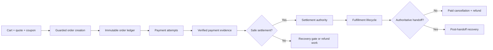
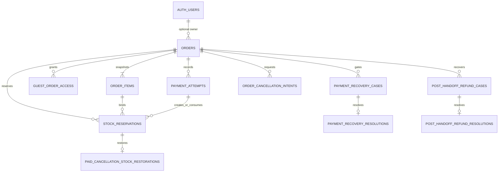
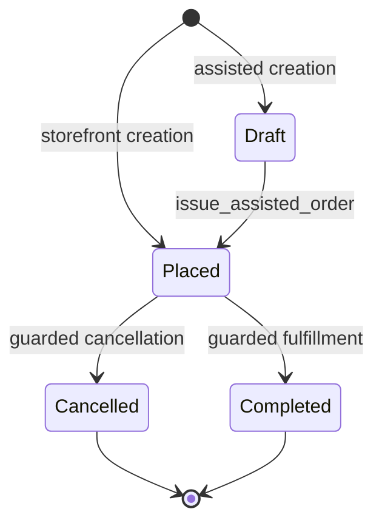
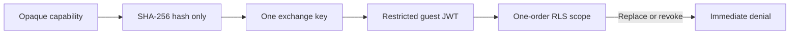

---
tags:
  - RPRT
  - database
  - commerce
  - orders
  - payments
  - settlement
  - stock-reservations
  - fulfillment
  - guest-access
  - RLS
  - schema
  - reference
type: schema-reference
status: reviewed
issue: RPRT-46
pull_request: https://github.com/guisaliba/repertorio/pull/22
last_verified: 2026-08-24
focused_assertions: 731
---
# Order and Settlement Security

> [!info] Reference Network
> [[Studio Repertório]] · [[Database Schemas]] · [[Cart, Quote and Coupons Security]] · [[Catalog Products Categories and Archival]] · [[Opaque Guest Access Token]] · [[RPRT-41 - Payment Recovery Gate Contract]] · [[RPRT-42 - Cancellation Intent and Paid-Stock Recovery Contract]]

> [!abstract] Commerce Ledger Boundary
> PostgreSQL creates immutable order snapshots, reserves stock, records verified payment truth, selects one settlement authority, controls cancellation and fulfillment, and sends unsafe outcomes to explicit recovery gates.

<table style="width:100%; border-collapse:separate; border-spacing:8px; margin:12px 0 18px 0;">
<tr>
<td style="width:25%; padding:12px; border:1px solid #d0d7de; border-radius:8px; background:rgba(112,48,160,0.09);"><strong>Scope</strong> Database authority</td>
<td style="width:25%; padding:12px; border:1px solid #d0d7de; border-radius:8px; background:rgba(0,176,80,0.09);"><strong>Focused Gate</strong> 731 / 731 passed</td>
<td style="width:25%; padding:12px; border:1px solid #d0d7de; border-radius:8px; background:rgba(0,176,240,0.09);"><strong>Review</strong> No findings</td>
<td style="width:25%; padding:12px; border:1px solid #d0d7de; border-radius:8px; background:rgba(255,192,0,0.12);"><strong>Delivery</strong> <a href="https://github.com/guisaliba/repertorio/pull/22">PR #22</a></td>
</tr>
</table>

> [!warning] Source Of Truth
> Repository migrations, pgTAP tests, and `docs/database.md` are authoritative. This note explains their contract; it does not replace them.

> [!tip] Visual Guides
> - [[Visual Explainers/PR-22 Order and Settlement Security Visual Explainer.html|PR #22 detailed system explainer]]
> - [[Visual Explainers/PR-22 Order and Settlement Schema Explorer.html|Interactive ERD for commerce, payment evidence, settlement, cancellation, and recovery]]
> - [[Visual Explainers/Account and Guest Order Journey Visual Explainer.html|Account and guest journey from access through settlement]]

## Contract At A Glance

| Authority | Invariant | Failure posture |
|---|---|---|
| **Order ledger** | Issued order and line snapshots never change | Reject direct insert, update, delete, or owner reassignment |
| **Payment truth** | Every verified provider fact remains visible | Reject conflicting event, subject, provider, amount, currency, or replay evidence |
| **Settlement** | One same-order, still-paid attempt grants authority | Open recovery or refund work; never guess |
| **Stock** | Quantity changes once for each approved fact | Roll back all lines when one line is unsafe |
| **Fulfillment** | Forward movement requires settlement and clear gates | Stop on cancellation intent, recovery gate, or invalid edge |
| **Guest access** | One finite, hash-only capability scopes one order | Fail closed on malformed, expired, revoked, replaced, or replayed access |

> [!success] Central Decision
> Verified payment truth is permanent evidence. It is not fulfillment authority. Only `orders.settlement_payment_attempt_id` grants that authority after all payment, stock, cancellation, and recovery checks pass.

## System Map

### Schema Inventory

<table style="width:100%; border-collapse:collapse; margin:8px 0 16px 0;">
<tr style="background:rgba(112,48,160,0.10);"><th style="text-align:left; padding:8px; border:1px solid #d0d7de;">Ledger and access</th><th style="text-align:left; padding:8px; border:1px solid #d0d7de;">Purpose</th></tr>
<tr><td style="padding:7px; border:1px solid #d0d7de;"><code>orders</code></td><td style="padding:7px; border:1px solid #d0d7de;">Identity, customer and delivery snapshots, totals, lifecycle, and payment pointers</td></tr>
<tr><td style="padding:7px; border:1px solid #d0d7de;"><code>order_items</code></td><td style="padding:7px; border:1px solid #d0d7de;">Product, package, quantity, price, and line-total snapshots</td></tr>
<tr><td style="padding:7px; border:1px solid #d0d7de;"><code>guest_order_access</code></td><td style="padding:7px; border:1px solid #d0d7de;">Hash-only, one-order capability lifecycle</td></tr>
<tr><td style="padding:7px; border:1px solid #d0d7de;"><code>payment_attempts</code></td><td style="padding:7px; border:1px solid #d0d7de;">One row for each provider checkout attempt</td></tr>
<tr><td style="padding:7px; border:1px solid #d0d7de;"><code>stock_reservations</code></td><td style="padding:7px; border:1px solid #d0d7de;">Active, consumed, or released direct-stock evidence</td></tr>
</table>

<table style="width:100%; border-collapse:collapse; margin:8px 0 16px 0;">
<tr style="background:rgba(192,0,0,0.08);"><th style="text-align:left; padding:8px; border:1px solid #d0d7de;">Evidence and recovery</th><th style="text-align:left; padding:8px; border:1px solid #d0d7de;">Purpose</th></tr>
<tr><td style="padding:7px; border:1px solid #d0d7de;"><code>webhook_event_subjects</code></td><td style="padding:7px; border:1px solid #d0d7de;">Exact local subject and provider-reference binding</td></tr>
<tr><td style="padding:7px; border:1px solid #d0d7de;"><code>private.payment_evidence_facts</code></td><td style="padding:7px; border:1px solid #d0d7de;">Normalized provider facts and lock-serialized paid precedence</td></tr>
<tr><td style="padding:7px; border:1px solid #d0d7de;"><code>payment_recovery_cases</code> / <code>payment_recovery_resolutions</code></td><td style="padding:7px; border:1px solid #d0d7de;">Unsafe payment gates and one authoritative outcome</td></tr>
<tr><td style="padding:7px; border:1px solid #d0d7de;"><code>order_cancellation_intents</code></td><td style="padding:7px; border:1px solid #d0d7de;">Durable paid-order cancellation intent</td></tr>
<tr><td style="padding:7px; border:1px solid #d0d7de;"><code>paid_cancellation_stock_restorations</code></td><td style="padding:7px; border:1px solid #d0d7de;">One approved restoration for each consumed reservation</td></tr>
<tr><td style="padding:7px; border:1px solid #d0d7de;"><code>post_handoff_refund_cases</code> / <code>post_handoff_refund_resolutions</code></td><td style="padding:7px; border:1px solid #d0d7de;">Refund recovery after authoritative handoff</td></tr>
</table>

Provider API calls, webhook signature checks, browser pages, email templates, and JWT signing are outside this boundary.

<strong>Entity relationship model</strong>

Auth-user deletion sets `orders.user_id` to null. It does not delete an order. Immutable customer, contact, delivery, and commercial snapshots preserve historical truth.

## Order Authority

| Boundary | Rule |
|---|---|
| Actor | `create_order` derives the account or verified guest actor |
| Idempotency | Exact replay returns the original order and attempt; changed accepted input is a conflict |
| Validation | Current cart, catalog, price, package, stock, quote, and coupon evidence is rechecked |
| Atomicity | Snapshots, evidence consumption, reservations, attempt, transitions, and durable work commit together |
| Assisted issue | Product eligibility is rechecked; exact replay remains pinned to the original attempt |
| Immutability | Issued lines reject insert, update, and delete; orders reject deletion and owner reassignment |
| Terminal coupling | `cancelled` equals fulfillment `cancelled`; `completed` equals fulfillment `fulfilled` |

> [!note] Owner Deletion
> Auth-user deletion can apply the declared `orders.user_id -> null` foreign-key action. It does not weaken the retained commercial snapshot.

## Payment And Settlement

### Attempt Lifecycle

| State | Payable | Meaning |
|---|:---:|---|
| `not_started` | Yes | Local attempt exists; no provider dispatch evidence |
| `creating` | Yes | Atomic provider-session work is ready |
| `creation_unknown` | Yes | Provider create result is ambiguous; blind retry is blocked |
| `pending` | Yes | Provider session exists and can still settle |
| `paid` | No retry | Verified payment truth exists |
| `failed` / `expired` | No | Verified non-payable truth can release stock |
| `refund_pending` / `refunded` | No | Historical payment remains visible while refund work converges |

Only one payable attempt can exist for an order. An open blocking recovery gate prevents a new attempt.

### Evidence Pipeline

1. `record_commerce_webhook_event` binds one event to one local subject and provider reference.
2. `apply_payment_event` or `reconcile_payment_attempt` validates provider, IDs, amount, currency, state, source, and subject.
3. `private.payment_evidence_facts` stores the normalized immutable fact.
4. `recorded_sequence` establishes paid precedence after the order lock is held.
5. The settlement decision checks payable competitors, stock, cancellation intent, and recovery gates.

> [!important] Pointer Separation
> `current_payment_attempt_id` selects retry work. It grants no fulfillment authority. `settlement_payment_attempt_id` is permanent historical authority and is never cleared by refund or cancellation.

## Stock Rules

`products.stock_quantity` means available stock.

| Operation | Reservation evidence | Available-stock effect |
|---|---|---|
| Reserve | `active` | Decrement once |
| Safe settlement | `consumed` | No second decrement |
| Verified non-payable release | `released` | Increment once |
| Paid-cancellation restoration | Consumed history plus one restoration fact | Increment once |
| Late-paid recovery | New consumed reservation or safe reacquisition | All required lines succeed or none do |

> [!success] Oversell Protection
> Products lock in stable UUID order. Reservations lock in stable reservation-ID order. Final-stock competition produces one safe reservation and one rejected loser.

## Recovery And Cancellation

### Recovery Decisions

| Situation | Durable result | Fulfillment effect |
|---|---|---|
| First safe paid fact | Settlement pointer and approval work | Forward fulfillment can start |
| Paid fact with unresolved risk | Blocking `settlement_recovery` case | Fulfillment stops |
| Deterministically later paid fact | Non-blocking `duplicate_refund` case and full-refund work | Existing settlement stays authoritative |
| Paid fact after cancellation | `cancelled_order_refund` work | Cancelled lifecycle stays authoritative |
| Verified refund after handoff | Post-handoff case and alert | Delivery truth is not rewritten |

Recovery replay must keep the original operation reference. Settlement acceptance requires the selected attempt to remain `paid`.

### Administrator Evidence

- Payment-recovery closure requires the same authenticated administrator, reason, proof reference, and idempotency key on replay.
- Post-handoff closure requires the same authenticated administrator, reason, and proof reference on replay.
- Administrator transitions bind `auth.uid()` to current administrator membership at insertion.
- The authorization fact stays immutable, so later staff removal does not invalidate historical handoff evidence.
- A privileged caller cannot claim another administrator identity.

### Paid Cancellation

1. Lock matching shipping-label work.
2. Reject processing, completed, dead-letter, or provider-evidenced label work.
3. Store immutable cancellation intent.
4. Request full refund without erasing paid truth.
5. On verified refund, cancel before handoff and restore each eligible stock line once.
6. After handoff, preserve delivery truth and open post-handoff recovery instead.

> [!danger] Fail-Closed Multi-Line Rule
> A forced failure on the second late-payment stock line leaves all stock unchanged and creates no reservation, resolution, or settlement transition. A forced failure on the second cancellation restoration line leaves all stock unchanged and creates no refund transition or restoration fact.

<strong>Exact validator bindings</strong>

- Recovery cases bind order, attempt, normalized event, provider, webhook subject, provider reference, actor, command source, transition edge, canonical reason, operation reference, checkout ID, payment ID, amount, currency, and recovery kind.
- Verified-refund and administrator resolutions require different exact evidence and cannot substitute for each other.
- Stock restoration binds consumed reservation and quantity to the settlement, normalized refund, cancellation transition, and cancellation intent.
- Post-handoff recovery binds the current fulfillment snapshot, retained settlement, normalized refund, and stored administrator-authorized handoff.

## Fulfillment Gates

<table style="width:100%; border-collapse:collapse; margin:8px 0 14px 0;">
<tr><td style="padding:8px; border:1px solid #d0d7de; background:rgba(0,176,80,0.08);"><strong>Required</strong> One accepted settlement pointer</td><td style="padding:8px; border:1px solid #d0d7de; background:rgba(0,176,80,0.08);"><strong>Required</strong> Valid current fulfillment edge</td></tr>
<tr><td style="padding:8px; border:1px solid #d0d7de; background:rgba(192,0,0,0.07);"><strong>Must be absent</strong> Active paid-cancellation intent</td><td style="padding:8px; border:1px solid #d0d7de; background:rgba(192,0,0,0.07);"><strong>Must be absent</strong> Open blocking recovery gate</td></tr>
</table>

Guarded commands cover production, readiness, label request, carrier transit, local or pickup handoff, verified fulfillment events, and completion. Fulfillment evidence must match the order shipping provider. Provider-specific mapping remains in a later trusted adapter.

## Guest Access

| Step | Contract |
|---:|---|
| 1 | PostgreSQL generates at least 256 bits of opaque entropy |
| 2 | The database stores only its SHA-256 hash and finite expiry |
| 3 | The trusted server supplies a separate HttpOnly same-site exchange key |
| 4 | First exchange stores only the exchange-key hash |
| 5 | Same capability and key replay is idempotent |
| 6 | A different key after exchange is rejected as replay |
| 7 | Revocation or replacement invalidates existing access through RLS |

The JWT uses role `guest_order`, `sub = guest_order_access.id`, and `rprt_session_kind = guest_order`.

> [!warning] Role Posture
> `guest_order` is `NOLOGIN`, `NOINHERIT`, `NOSUPERUSER`, `NOCREATEDB`, `NOCREATEROLE`, `NOREPLICATION`, and `NOBYPASSRLS`. Only `authenticator` can assume it. PostgreSQL can retain a creator administration grant only when inheritance and set-role are denied.

PostgreSQL does not sign JWTs. A later trusted route must import an asymmetric Supabase signing key and own secure cookie flags. Signing keys, raw capabilities, and raw exchange keys do not belong in source, tables, logs, or query strings.

## Access Matrix

| Actor | Read scope | Mutation scope | Explicitly hidden |
|---|---|---|---|
| Account owner | Own orders, items, safe payment status | Customer commands only | Provider IDs, raw status, recovery proof |
| Verified guest | One order from active capability | No lifecycle table writes | Capability hashes and operational evidence |
| Administrator | Explicit admin policies and guarded staff commands | Approved command functions | No broad protected-evidence mutation |
| Worker / `service_role` | Command-required evidence | Narrow worker functions | No general commerce table authority |
| `PUBLIC` / `anon` | None for protected commerce data | None | All protected ledger and evidence data |

Security-definer functions use an empty fixed `search_path`, derive their actor, and expose exact execute grants. Protected evidence rejects direct application-role mutation.

## Lock Order

> [!example] Reviewed Relative Order
> `authenticated cart` → `order` → `payment attempts` → `recovery cases` → `products by UUID` → `reservations by UUID` → `shipping quote` → `coupon`

Each command rechecks its guards after it holds the required locks. Label cancellation also locks related shipping-label jobs before it decides whether no-call completion is safe.

## Concurrency Evidence

> [!success] Result
> Committed-session pgTAP uses separate `dblink` sessions, finite waits, deterministic fixtures, and verified cleanup. The focused gate proves both winner orders for the material cancellation, handoff, refund, label, and guest-access races.

<strong>Open the complete committed-race matrix</strong>

| First committed operation | Competitor | Proven convergence |
|---|---|---|
| Storefront first call | Same first call | One order, line, attempt, reservation, quote consumption, stock decrement, three transitions, and two jobs |
| Assisted draft first call | Same first call | One draft and line; no attempt or outbox work |
| Final-stock reservation | Other order reservation | Loser gets `55000`; no oversell |
| First active attempt | Second attempt | Loser gets `55000`; one payable attempt remains |
| First lock-serialized paid fact | Other paid fact | Winner settles; loser enters duplicate-refund recovery |
| Settlement | Failure and release | Loser gets `23514`; no double stock effect |
| Recovered settlement | Administrative closure | Closure gets `23514`; one settlement resolution remains |
| Paid cancellation | Pickup, carrier, or local handoff | Handoff gets `55000`; cancellation intent and refund work remain |
| Pickup, carrier, or local handoff | Paid cancellation | Cancellation gets `55000`; handoff truth remains |
| Verified refund | Waiting handoff | Handoff gets `55000`; cancellation converges once |
| Carrier or local handoff | Verified refund | Both commit; post-handoff case preserves delivery truth |
| First duplicate-refund delivery | Same refund delivery | One refund effect and one restoration fact |
| Webhook recording | Settlement | Waiter commits without deadlock; one subject and settlement remain |
| Guest exchange | Replacement or revocation | Exchange evidence remains; access becomes invalid |
| Replacement or revocation | Guest exchange | Exchange gets `55000`; successor or revocation remains |
| Paid cancellation | Label claim | Claim skips the locked label; cancellation commits |
| Label claim | Paid cancellation | Cancellation gets `55000`; label stays processing |

## Durable Effects

| Business event | Durable work |
|---|---|
| Order placement | Order confirmation and payment-session creation |
| Assisted issue | Assisted-order notification and payment-session creation |
| Safe settlement | Payment approval |
| Unsafe payment | Recovery-required work |
| Refund request | Fail-closed full-refund work |
| Fulfillment readiness | Shipping-label creation when safe |
| Carrier handoff | Tracking notification |

A business transaction and its approved outbox work commit together.

## Verification

<table style="width:100%; border-collapse:collapse; margin:8px 0 16px 0;">
<tr style="background:rgba(0,176,80,0.10);"><th style="text-align:left; padding:8px; border:1px solid #d0d7de;">Gate</th><th style="text-align:center; padding:8px; border:1px solid #d0d7de;">Result</th></tr>
<tr><td style="padding:7px; border:1px solid #d0d7de;">RPRT-46 focused pgTAP</td><td style="padding:7px; text-align:center; border:1px solid #d0d7de;">731 / 731 PASSED</td></tr>
<tr><td style="padding:7px; border:1px solid #d0d7de;">Full database runner</td><td style="padding:7px; text-align:center; border:1px solid #d0d7de;">1,524 planned · 1,521 reached · one known baseline</td></tr>
<tr><td style="padding:7px; border:1px solid #d0d7de;">Reset, migrations, lint, schema diff</td><td style="padding:7px; text-align:center; border:1px solid #d0d7de;">PASSED</td></tr>
<tr><td style="padding:7px; border:1px solid #d0d7de;">Storage integration</td><td style="padding:7px; text-align:center; border:1px solid #d0d7de;">11 / 11 passed</td></tr>
<tr><td style="padding:7px; border:1px solid #d0d7de;">Unit tests</td><td style="padding:7px; text-align:center; border:1px solid #d0d7de;">39 / 39 passed</td></tr>
<tr><td style="padding:7px; border:1px solid #d0d7de;">Format, ESLint, TypeScript, dependencies</td><td style="padding:7px; text-align:center; border:1px solid #d0d7de;">PASSED</td></tr>
<tr><td style="padding:7px; border:1px solid #d0d7de;">Architecture freshness and production build</td><td style="padding:7px; text-align:center; border:1px solid #d0d7de;">PASSED</td></tr>
<tr><td style="padding:7px; border:1px solid #d0d7de;">Independent security and acceptance review</td><td style="padding:7px; text-align:center; border:1px solid #d0d7de;">NO FINDINGS</td></tr>
</table>

> [!warning] Known Baseline
> `outbox_replay.test.sql:440` still fails because `service_role` has no direct `SELECT` grant on `outbox_jobs`. The failure prevents that result and the final two planned results from being emitted. Every other database file passes.

> [!info] Delivery Status
> PR #22 is open and ready for review. Architecture freshness and Vercel Preview Comments pass. Vercel deployment is blocked by project access, so GitHub reports the PR as unstable; the local production build passes. Migration promotion correctly denies local execution without the protected `dev` and staging approval environment.

<strong>Repository sources</strong>

- `supabase/migrations/20260823204718_add_order_snapshot_schema.sql`
- `supabase/migrations/20260823205154_add_guest_order_access_schema.sql`
- `supabase/migrations/20260823205528_add_payment_attempt_schema.sql`
- `supabase/migrations/20260823205830_add_stock_reservation_schema.sql`
- `supabase/migrations/20260823210148_add_payment_recovery_schema.sql`
- `supabase/migrations/20260823210449_add_cancellation_recovery_schema.sql`
- `supabase/migrations/20260823210912_add_guest_order_access_commands.sql`
- `supabase/migrations/20260823210921_add_payment_settlement_commands.sql`
- `supabase/migrations/20260823210928_add_order_creation_commands.sql`
- `supabase/migrations/20260823210935_add_cancellation_fulfillment_commands.sql`
- `supabase/tests/order_settlement_concurrency.test.sql`
- `supabase/tests/cancellation_label_concurrency.test.sql`
- `supabase/tests/commerce_webhook_subject_binding.test.sql`

> [!summary] Core Rule
> Payment facts remain permanent. Settlement authority remains singular. Stock changes once. Every uncertain outcome fails closed into explicit recovery evidence.
