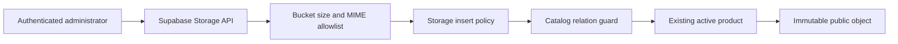

---
tags:
  - RPRT
  - product-media
  - supabase-storage
  - security
  - RLS
  - database
  - reference
type: storage-reference
---
[[Studio Repertório]]
[[Catalog Products Categories and Archival]]
[[Database Schemas]]
[[Administrator Membership Schema]]

# Product Media Storage

> [!abstract] Product Media Storage Reference
> This note describes the Supabase Storage contract for immutable Studio Repertório product media. It covers the bucket, object paths, actors, upload rules, public delivery, archival concurrency, validation boundaries, and verification evidence.

> [!info] Storage Contract
> Product-media object identity is immutable. Relational media presentation data and Storage object delivery remain separate boundaries.

> [!warning] Source Of Truth
> The repository migration, tests, and `docs/database.md` are authoritative.

> [!example] Visual Explainer
> [[Visual Explainers/RPRT-10 Product Media Storage Visual Explainer.html|Open the local product media visual explainer]]

## <span style="color:rgb(112, 48, 160)">Storage Boundary</span>

M1 creates one bucket.

| Property | Contract |
|---|---|
| Bucket | `product-media` |
| Visibility | Public exact-URL delivery |
| Maximum object size | 50 MiB, or `52,428,800` bytes |
| Image MIME types | `image/jpeg`, `image/png`, `image/webp` |
| Video MIME type | `video/mp4` |
| Object path | `products/<product-uuid>/<random-v4-uuid>.<extension>` |
| Object identity | Immutable |

The MVP does not create an editorial-media bucket or an unused private bucket. Posts, editorial media, newsletters, and newsletter capture are post-MVP goals.

## <span style="color:rgb(0, 176, 240)">Upload Flow</span>



An upload succeeds only when all these conditions pass:

1. The caller uses the `authenticated` database role.
2. `public.is_admin()` confirms active administrator membership.
3. The bucket is exactly `product-media`.
4. The path contains the related product UUID and a random UUID-v4 object identity.
5. The extension is `jpg`, `jpeg`, `png`, `webp`, or `mp4`.
6. Storage MIME metadata matches the extension.
7. The object is no larger than 50 MiB.
8. The related product exists and is not archived.
9. The upload acquires the catalog relation guard before it checks product state.

## <span style="color:rgb(0, 176, 80)">Actor Matrix</span>

| Actor | Upload | List object names | Exact public URL | Overwrite or delete |
|---|---:|---:|---:|---:|
| Anonymous | Denied | Denied | Allowed when URL is known | Denied |
| Customer | Denied | Denied | Allowed when URL is known | Denied |
| Administrator | Approved objects only | Allowed through exact `object.list` | Allowed | Denied |
| `service_role` | Bypasses RLS | Bypasses RLS | Allowed | Bypasses RLS |

> [!danger] Service Role
> Supabase `service_role` bypasses Storage RLS. Keep it server-only and outside ordinary media work. The normal product-media path uses authenticated administrator policies.

## <span style="color:rgb(255, 192, 0)">Accepted File Validation Boundary</span>

The implemented M1 boundary validates:

- Caller authorization.
- Bucket identity.
- Object size.
- Declared MIME type.
- MIME-to-extension matching.
- Product-bound UUID-v4 path.
- Existing unarchived product state.

M1 does not perform deep byte inspection, malware scanning, or full media decoding. This is an accepted project decision, and no additional M1 work is required.

A file with an allowed MIME declaration and matching extension can pass the Storage checks even when its bytes are not a valid image. Storage saves bytes as an object; it does not execute them. A normal anonymous or customer actor still cannot upload such a file because the actor policy fails first.

M2 can add application-level file-signature, dimension, and alt-text checks as part of the upload flow. These checks do not change the approved M1 Storage policy boundary.

## <span style="color:rgb(112, 48, 160)">Immutable Replacement</span>

Application roles cannot update, move, overwrite, or delete a product-media object.

Replacement uses this sequence:

1. Generate a new UUID-v4 object identity.
2. Upload a new object at a new path.
3. Insert a new `public.product_media` relation.
4. Deactivate the old media relation.
5. Keep the old object until a separately approved deletion or retention workflow exists.

M1 has no object deletion, orphan cleanup, purge, or archive-recovery workflow.

## <span style="color:rgb(0, 112, 192)">Archival Concurrency</span>

Product archive and Storage insert use the same catalog relation advisory guard before the product row lock.

This ordering prevents this race:

1. An upload checks that a product is active.
2. Another transaction archives the product.
3. The upload commits an object for the archived product.

A waiting upload rechecks product state after archival commits. It fails when the product is archived.

## <span style="color:rgb(255, 192, 0)">Public Delivery And Discovery</span>

The bucket is public, but listing and discovery are separate.

- A caller with an exact public URL can retrieve the object.
- Anonymous and customer list calls expose no object names.
- Public catalog queries expose media only when the media relation is active and the related product is public.
- Draft, inactive, and archived media are absent from relational catalog discovery.
- Archival does not revoke a copied public URL or an already cached object.

> [!warning] Not A Confidentiality Boundary
> Product media is public content. The bucket prevents ordinary object-name enumeration, but a known URL is retrievable.

## <span style="color:rgb(0, 176, 80)">Verification</span>

| Test boundary | Evidence |
|---|---:|
| Catalog constraints | 194 pgTAP assertions |
| Archive and Storage concurrency | 29 pgTAP assertions |
| Storage bucket and policies | 21 pgTAP assertions |
| Loopback Storage API | 11 Vitest assertions |
| Changed database total | 244 pgTAP assertions |
| Unit tests | 39 Vitest assertions |

Primary commands:

```bash
pnpm db:reset
pnpm db:migrations
pnpm db:lint
pnpm exec supabase test db supabase/tests/catalog_schema.test.sql supabase/tests/catalog_schema_concurrency.test.sql supabase/tests/product_media_storage.test.sql --local
pnpm test:storage
```

The loopback API test refuses non-loopback hosts, does not print local keys, uses isolated random fixtures, and removes Storage, Auth, catalog, outbox, and audit fixtures after the suite.

## <span style="color:rgb(112, 48, 160)">Ownership After M1</span>

| Scope | Owner |
|---|---|
| Bucket, policies, path, size, MIME, and archive guard | M1 / RPRT-10 |
| Upload helpers, server validation, admin interface, and caching | M2 |
| Object deletion, orphan cleanup, purge, and recovery workflow | Future reviewed work |
| Independent original-media archive and tested restore procedure | M7 |
| Editorial media, posts, and newsletters | Post-MVP Future Goals |

## <span style="color:rgb(0, 176, 240)">References</span>

- [RPRT-10](https://linear.app/guisaliba/issue/RPRT-10/implement-supabase-storage-security-contracts)
- [PR #20](https://github.com/guisaliba/repertorio/pull/20)
- [Dark-theme PR visual explainer](https://uploads.linear.app/445023d5-264c-47cb-a70c-e4a15a58da5c/ffec53f6-2bd7-498e-89ec-8a42fcfe26d6/3fa8941c-4e77-4de0-9c11-3ea88f86b8d7)
- [`20260821061509_add_product_media_storage_security.sql`](https://github.com/guisaliba/repertorio/blob/feat/rprt-10-storage-security/supabase/migrations/20260821061509_add_product_media_storage_security.sql)
- [`docs/database.md`](https://github.com/guisaliba/repertorio/blob/feat/rprt-10-storage-security/docs/database.md)
