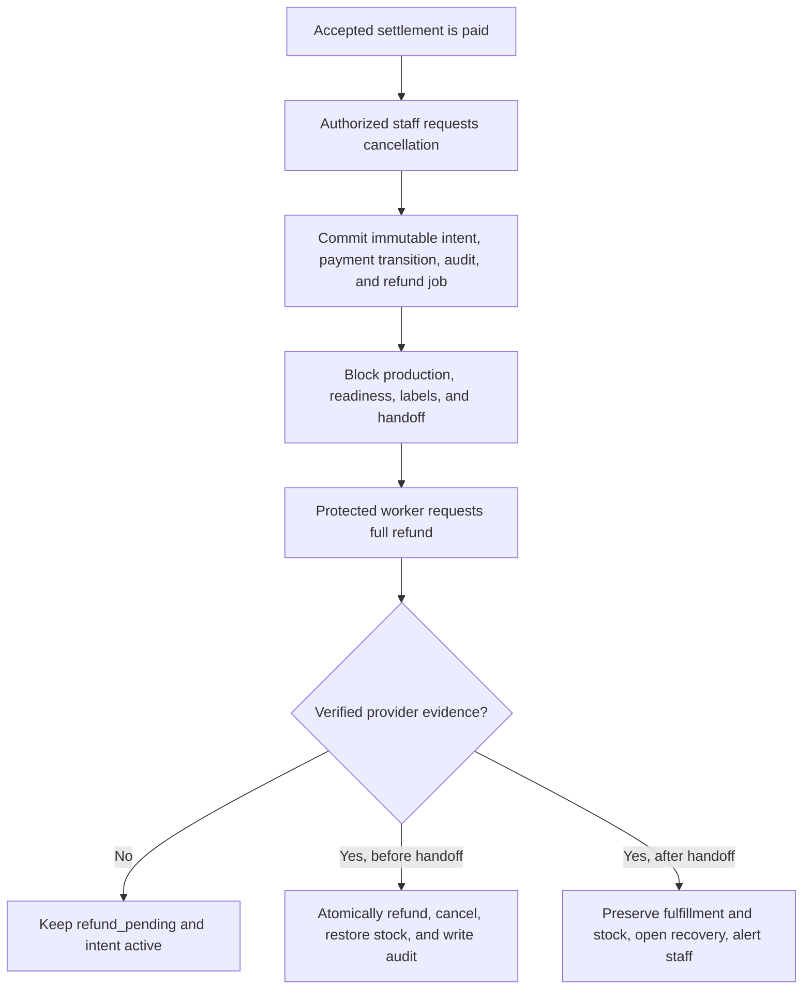

> [!abstract] RPRT-42 Contract Guide
> How immutable cancellation intent, verified refund evidence, order-lock races, and exactly-once stock restoration make paid cancellation safe.

| Reference | Link |
|---|---|
| Linear issue | [RPRT-42](https://linear.app/guisaliba/issue/RPRT-42/define-cancellation-intent-and-paid-stock-recovery-rules) |
| Normative contract | [Cancellation Intent and Paid-Stock Recovery Contract](https://linear.app/guisaliba/document/rprt-42-cancellation-intent-and-paid-stock-recovery-contract-862263dca56a) |
| Visual explainer | [RPRT-42 visual explainer in Linear](https://uploads.linear.app/445023d5-264c-47cb-a70c-e4a15a58da5c/642159b2-cf20-4f11-874f-4f706450cb9a/b44a084d-a1ca-4d90-a11b-c869b9211829) |

## <span style="color:rgb(0, 112, 192)">Purpose</span>

A paid order cannot cancel safely from a staff request alone. The payment provider must first verify the full refund. The system must also stop fulfillment and return stock without losing history or applying the same stock effect twice.

This contract separates the work into three facts:

1. Staff requests paid cancellation.
2. The provider verifies the full refund.
3. The database cancels the order and applies all local effects atomically.

> [!important] Core Rule
> Cancellation intent starts and blocks the process. Only verified full-refund evidence completes paid cancellation.

## <span style="color:rgb(112, 48, 160)">The Complete Paid-Cancellation Flow</span>



The provider call is outside PostgreSQL. PostgreSQL cannot include a remote provider API call in its transaction.

The contract therefore uses two local transactions:

| Transaction | Local effects |
|---|---|
| Intent transaction | Intent, `paid -> refund_pending`, audit, and refund outbox job |
| Convergence transaction | `refund_pending -> refunded`, order cancellation, fulfillment cancellation, stock restoration, audit, and recovery effects |

If one required local effect fails, its full transaction rolls back.

## <span style="color:rgb(0, 176, 80)">Cancellation Intent</span>

`order_cancellation_intents` records one accepted paid-cancellation request.

The intent is not an order state. The order remains `placed` while the refund is pending.

One order can have no more than one accepted intent. The intent kind is fixed to:

```text
full_refund_then_cancel
```

The intent records:

| Field | Meaning |
|---|---|
| `id` | Database-generated intent identity |
| `order_id` | The affected order; unique in this table |
| `intent_kind` | `full_refund_then_cancel` |
| `settlement_payment_attempt_id` | The exact accepted settlement attempt |
| `refund_request_transition_id` | The exact `paid -> refund_pending` transition |
| `requested_by_staff_id` | Authenticated staff actor |
| `reason` | Required safe operational reason |
| `idempotency_key` | Unique request identity |
| `requested_at` | Database time |

The intent, exact payment transition, audit evidence, and refund job commit together or none commit.

> [!warning] Intent Cannot Be Withdrawn
> Accepted intent cannot be cleared, updated, deleted, deactivated, replaced, or withdrawn. A provider timeout, unknown result, dead letter, elapsed time, or staff statement leaves it active.

## <span style="color:rgb(255, 192, 0)">The Three Important Transitions</span>

### Refund-Request Transition

`refund_request_transition_id` identifies the transition that starts refund work:

```text
payment_attempt: paid -> refund_pending
```

This transition proves that authorized staff accepted paid cancellation for the exact settlement attempt. It does not prove that the provider completed the refund.

### Verified-Refund Transition

`refund_transition_id` identifies the transition that applies verified provider truth:

```text
payment_attempt: refund_pending -> refunded
```

Only an authenticated webhook or protected provider lookup can authorize this transition. A browser redirect, raw provider status, timeout, or staff statement cannot authorize it.

### Cancellation Transition

`cancellation_transition_id` identifies the order transition:

```text
order: placed -> cancelled
```

For normal paid cancellation, the verified-refund transition and cancellation transition commit in the same database transaction.

> [!summary] Why Stock Restoration Stores Both IDs
> The refund transition proves that the provider returned the money. The cancellation transition proves that the matching order cancelled. Both facts are required before paid stock returns to availability.

## <span style="color:rgb(192, 0, 0)">Hard Fulfillment Gate</span>

Active intent blocks all forward fulfillment work:

1. Start production.
2. Advance production.
3. Mark ready for fulfillment.
4. Create a shipping label.
5. Record carrier handoff.
6. Confirm pickup or local handoff.

Each command locks the order and rechecks intent before it changes state or calls a provider.

Pre-handoff forward work also requires:

- order state `placed`;
- the historical settlement pointer to reference an attempt that is currently `paid`;
- no active cancellation intent;
- no open blocking payment-recovery gate.

## <span style="color:rgb(112, 48, 160)">First-Commit Race Rule</span>

Cancellation, refund, production, label, and handoff commands lock the order first. Concurrent commands serialize on this lock.

The first transaction to commit defines authoritative truth. A waiting transaction gets the lock, reads the new truth, and rejects if the truth conflicts with its operation.

| First committed result | Competing result |
|---|---|
| Cancellation intent | Production, readiness, label, and handoff commands reject |
| Carrier, pickup, or local handoff | Paid-cancellation request rejects and creates no refund work |
| Verified pre-handoff refund convergence | Order and fulfillment cancel; later handoff rejects |
| Handoff before unexpected verified refund | Fulfillment continues; separate recovery opens |

## <span style="color:rgb(192, 0, 0)">Shipping-Label Race</span>

A shipping label is an external provider effect. A label can exist even when the local worker receives no clear response.

The contract uses these fail-closed rules:

| Label condition | Cancellation result |
|---|---|
| Unclaimed `pending` label job | Intent can win; the worker rechecks intent and must not dispatch |
| `processing` label job | Reject paid cancellation |
| Ambiguous provider result | Reject paid cancellation |
| Completed label job | Reject paid cancellation |
| Provider label evidence | Reject paid cancellation |

RPRT-25 must later prove whether Jadlog supports safe label cancellation. Until then, processing, ambiguous, completed, or provider-confirmed label truth blocks paid cancellation.

> [!warning] No Label After Intent
> A protected label worker must lock the order and recheck cancellation intent immediately before provider dispatch.

## <span style="color:rgb(0, 176, 80)">Consumed-Stock Restoration</span>

Payment changes an active stock reservation to terminal `consumed`. Paid cancellation must not rewrite that history.

The contract adds `paid_cancellation_stock_restorations`. Each row records one return of consumed stock to available quantity.

| Field | Meaning |
|---|---|
| `reservation_id` | Primary key; one restoration maximum per consumed reservation |
| `order_id` | Same order as the reservation |
| `product_id` | Same product as the reservation |
| `quantity` | Exact immutable reservation quantity |
| `refund_transition_id` | Verified full-refund transition |
| `cancellation_transition_id` | Same-transaction order cancellation transition |
| `restored_at` | Database time |

The required restoration set is every direct-stock reservation that the accepted settlement consumed for the order. The set cannot omit an eligible reservation or include an unrelated reservation.

```text
Consumed reservations remain consumed.
Restoration facts are inserted once.
Product quantity increases once.
All required rows and increments commit, or none commit.
```

Automatic restoration applies when fulfillment is:

- `unfulfilled`;
- `in_production`;
- `ready_for_fulfillment`.

It applies only before carrier, pickup, or local handoff. Assisted orders have no stock reservation or restoration effect.

## <span style="color:rgb(255, 192, 0)">Settlement Pointer</span>

`orders.settlement_payment_attempt_id` permanently identifies the payment attempt that the system accepted as settlement.

The pointer remains after refund and cancellation because it is historical evidence. The system does not clear or replace it.

Before handoff, the pointer authorizes forward fulfillment only when:

- its payment attempt is currently `paid`;
- no active cancellation intent exists;
- no blocking payment-recovery case exists.

After refund, the pointer still identifies historical settlement but cannot authorize pre-handoff fulfillment.

## <span style="color:rgb(192, 0, 0)">Post-Handoff Refund Recovery</span>

Carrier, pickup, or local handoff is authoritative. Normal cancellation cannot rewrite it.

If verified full-refund evidence arrives after handoff, the system:

1. Records the accepted settlement attempt as `refunded`.
2. Preserves order and fulfillment state.
3. Preserves consumed reservations and stock quantity.
4. Preserves the historical settlement pointer.
5. Opens one `post_handoff_refund_cases` row.
6. Emits an immediate independent operational alert.
7. Permits post-handoff tracking to continue.

This recovery is separate from the RPRT-41 unsafe-paid recovery gate. It is non-blocking for post-handoff tracking.

One optional `post_handoff_refund_resolutions` row records the final operational outcome. Administrative closure requires authenticated staff, a written reason, append-only proof, a unique resolving transition, and database time.

Administrative closure cannot:

- rewrite order, payment, or fulfillment truth;
- restore stock automatically;
- change the settlement pointer;
- request another refund;
- create customer email work.

## <span style="color:rgb(0, 112, 192)">Unpaid Cancellation</span>

Unpaid cancellation can release stock only after every payment attempt is terminal and verified non-payable.

| Attempt state | Rule |
|---|---|
| `not_started` | Can be superseded only with proof that no provider call occurred and an approved audit reason |
| `creating` | Blocks cancellation until verified provider evidence resolves it |
| `creation_unknown` | Blocks cancellation until reconciliation resolves it |
| `pending` | Blocks cancellation until verified provider evidence resolves it |
| Verified provider cancellation | Map to `failed` with reason `provider_checkout_cancelled_verified` |
| Verified provider expiry | Map to `expired` |

The payment lifecycle does not add a `cancelled` state.

After all attempts are terminal non-payable, one transaction cancels order and fulfillment, releases active reservations exactly once, returns available quantity exactly once, writes audit, and creates only required existing outbox work.

A late payment never reopens a cancelled order. It enters cancelled-order refund recovery.

## <span style="color:rgb(112, 48, 160)">Authorization And Lock Order</span>

Customers, guests, staff, workers, `anon`, and `authenticated` cannot directly insert, update, or delete intent, restoration, case, or resolution evidence.

Authorized actors use narrow guarded commands with:

- derived actor identity;
- reviewed signatures;
- fixed safe `search_path`;
- exact state guards;
- immutable audit;
- idempotency.

The common relative lock order is:

```text
1. order
2. affected payment attempts by stable ID
3. recovery cases by stable ID
4. products by stable ID
5. reservations by stable ID
6. append-only intent, restoration, recovery, audit, and outbox inserts
```

A command can skip an inapplicable class, but it cannot change the relative order.

## <span style="color:rgb(0, 176, 80)">Idempotency</span>

| Effect | Stable identity |
|---|---|
| Cancellation intent | One intent per order and one caller idempotency key |
| Full-refund job | `full-refund:<payment-attempt-id>:<refund-request-transition-id>` |
| Provider evidence | Provider event or protected reconciliation deduplication key |
| Stock restoration | One row per consumed reservation |
| Post-handoff case | One case per verified-refund transition |
| Administrative resolution | One row per case and one resolving transition |

A retry cannot create a replacement attempt, intent, transition, restoration, case, or job to bypass prior history.

## <span style="color:rgb(192, 0, 0)">Failure Behavior</span>

| Failure | Required result |
|---|---|
| Refund timeout or unknown result | Keep `refund_pending` and intent active; require verified evidence |
| Refund job dead letter | Keep intent active and alert operations independently |
| Stock restoration failure | Roll back all local refund convergence effects |
| Duplicate refund webhook | Return the first result; do not repeat stock or audit |
| Handoff wins first | Reject cancellation request and create no refund work |
| Unexpected refund after handoff | Preserve fulfillment and stock; open recovery and alert |
| Duplicate-payment refund | Refund only the duplicate; do not satisfy intent or restore settlement stock |
| Late payment on cancelled order | Keep order terminal and use cancelled-order refund recovery |

## <span style="color:rgb(255, 192, 0)">Explicit Scope Boundaries</span>

The contract does not add:

- a return lifecycle;
- partial refunds;
- customer-initiated cancellation;
- automatic unpaid-order timing;
- cancellation or refund-confirmation customer email;
- safe provider label cancellation before RPRT-25 supplies evidence.

## <span style="color:rgb(0, 176, 80)">Required Database Proof</span>

RPRT-46 must prove:

- one request creates one intent, payment transition, audit result, and refund job;
- duplicate delivery creates no duplicate effect;
- accepted intent cannot change or be withdrawn;
- intent blocks all forward fulfillment commands;
- intent, label, refund, and handoff races have deterministic results;
- verified refund convergence is atomic;
- failed local effects roll back together;
- consumed reservations remain consumed;
- the complete eligible direct-stock set restores all-or-none and at most once;
- assisted cancellation has no stock effect;
- duplicate-payment and cancelled-order refunds cannot satisfy intent;
- post-handoff refund preserves fulfillment and stock and creates one recovery case and alert;
- unverified provider cancellation cannot release stock;
- late payment never reopens a cancelled order;
- historical settlement cannot authorize unsafe fulfillment;
- cross-order references, direct mutation, and unauthorized command execution fail.

> [!summary] Summary
> Store immutable intent, stop forward work, wait for verified refund truth, converge every local effect atomically, preserve consumed reservation history, and fail closed whenever provider or handoff truth is uncertain.
