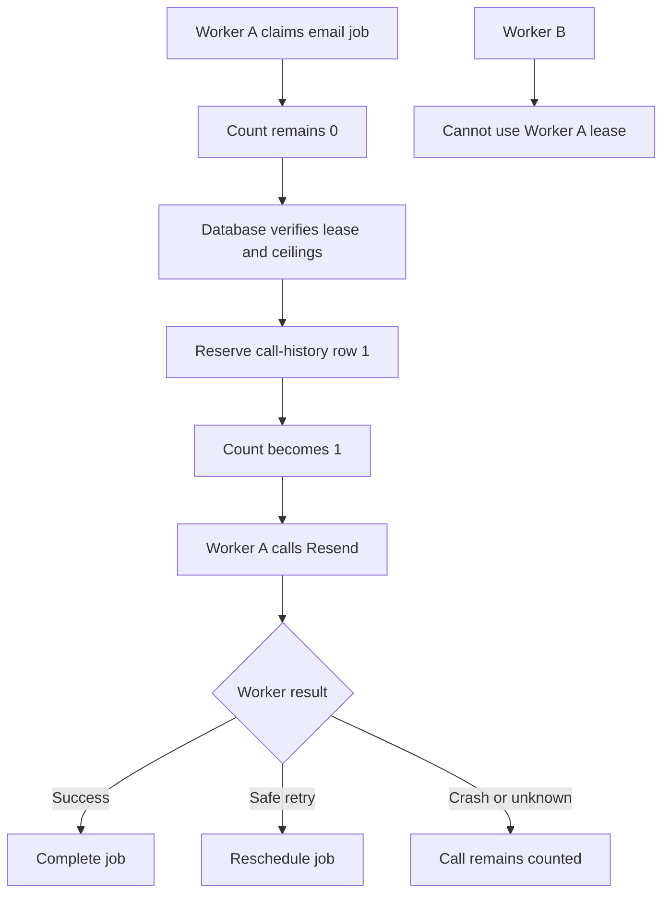

> [!abstract] RPRT-43 Contract Guide
> How provider-call counting, atomic reservation, immutable history, timeouts, and leases prevent duplicate external effects.

| Reference | Link |
|---|---|
| Linear issue | [RPRT-43](https://linear.app/guisaliba/issue/RPRT-43/define-per-operation-outbox-retry-and-protected-replay-budgets) |
| Approved policy | [Outbox Retry and Protected Replay Policy](https://linear.app/guisaliba/document/rprt-43-outbox-retry-and-protected-replay-policy-95a7108529e8) |

## Purpose

This contract controls how workers call external providers such as Resend. It prevents two workers from processing the same job, limits duplicate effects, and keeps permanent call evidence.

> [!important] Core Rule
> A claim does not consume a provider call. The count increases only when the database authorizes dispatch.

## Claim Versus Provider Call

A worker first **claims** a job. A claim means that the worker owns the job for a limited time.

Claiming a job does not increase `provider_call_count`. The count increases only when the worker is ready to call the provider.

| Event | Increases `provider_call_count`? |
|---|:---:|
| Worker claims a job | No |
| Lease is recovered | No |
| Local validation fails before dispatch | No |
| Database reserves a provider call | Yes |

## Atomic Checks Before Dispatch

Before the provider call, the database performs these actions in one atomic transaction:

1. Verify that the worker owns the job with the correct lease token.
2. Verify that the automatic, replay, and lifetime ceilings permit one more provider call.
3. Create one append-only call-history row.
4. Increment `provider_call_count`.

> [!success] Atomic Result
> All four actions succeed together or none of them happen. This prevents two workers from calling the provider for the same job at the same time.

One claim can reserve no more than one provider call.

## Call Ceilings

An email job can have these limits:

| Ceiling   | Limit | Meaning                                          |
| --------- | :---: | ------------------------------------------------ |
| Automatic |   5   | Normal provider calls under the retry policy     |
| Replay    |   1   | One administrator-approved extra call            |
| Lifetime  |   6   | Maximum provider calls for the full job lifetime |

> [!note] Replay Rule
> Replay does not reset the first five calls. It permits one additional call within the lifetime ceiling.

## Append-Only History

Each authorized provider call gets a permanent history row. The row cannot be changed or deleted.

It records that the system authorized a call, even if the worker later crashes. This gives reliable audit evidence.

## Conservative Counting

If the worker fails before call reservation, `provider_call_count` does not increase.

If the worker reserves a call and then crashes, the call remains counted. The database cannot prove that the request did not reach the provider.

> [!warning] Safety First
> Counting a possible call is safer than making another call and creating a duplicate payment, email, refund, or shipping label.

## Lease Token And Owner

The lease token identifies one processing claim. The lease owner identifies the worker that holds it.

The database checks both values before it permits a provider call. A stale or different worker cannot use another worker's claim.

## Timeouts

| Timeout | Value | Meaning |
|---|:---:|---|
| Connection | 3 seconds | The provider connection must start within this time |
| Total | 15 seconds | The complete normal request must finish within this time |
| Recovery lookup | 20 seconds | A read-only payment recovery lookup can use this total time |

The connection timeout is part of the total timeout. It is not added to it.

## Lease Duration

Lease duration is the total timeout plus 30 seconds.

| Operation | Calculation | Lease |
|---|---|:---:|
| Normal provider call | `15s + 30s` | 45 seconds |
| Payment recovery lookup | `20s + 30s` | 50 seconds |

> [!info] Completion Margin
> The extra 30 seconds lets the worker store the provider result and complete, reschedule, or dead-letter the job.

## No Heartbeat Extension In M1

A worker cannot extend its lease while it processes a job. This keeps the M1 concurrency model simple and prevents a failed worker from holding a job indefinitely.

A later architecture review can add lease heartbeats if operation duration or workload evidence requires them.

## Example Flow

### After A Crash Or Unknown Result

If the worker crashes after call reservation, or cannot confirm the Resend result:

1. The provider call remains counted.
2. The job waits for its lease to expire.
3. A new worker can claim the job.
4. If the automatic call budget remains and less than 24 hours passed, the new worker retries with the same Resend idempotency key and request fingerprint.
5. If Resend accepted the first call, Resend returns the original result without sending another email.
6. If retries are exhausted, the request fingerprint changes, or the 24-hour idempotency window expires, the job moves to `dead_letter`.
7. The `dead_letter` transition creates an operations alert.
8. A later protected replay requires administrator approval and immutable proof that Resend did not accept the email.

> [!warning] Unknown Does Not Mean Failed
> A missing response does not prove that Resend rejected the email. The system keeps the call counted and reuses the same idempotency key to prevent duplicate delivery.

> [!note] Pre-Dispatch Crash
> If the worker crashes before it reserves the provider call, the call is not counted and the job can retry normally.

1. Worker A claims an email job. The count stays at 0.
2. Worker A presents its lease token and reserves one provider call.
3. The database creates call-history row 1 and changes the count to 1.
4. Worker A calls Resend.
5. Worker A stores the result and completes or reschedules the job.
6. Worker B cannot call Resend with Worker A's lease token.
7. If Worker A crashes after reservation, call 1 remains counted because the request outcome can be unknown.

> [!summary] Summary
> Claim first, authorize one call atomically, preserve permanent evidence, and never assume that an unknown provider call did not happen.
