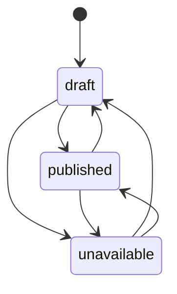

---
tags:
  - RPRT
  - database
  - catalog
  - product-status
issue: RPRT-50
status: In Review
---
# RPRT-50 Catalog Authority and Product Status

> [!abstract] Catalog Contract
> RPRT-50 defines the M1 database authority for categories, products, product media, and timed merchandising placements. The database owns public visibility, sales-mode validity, shipping-package resolution, administrator commands, and transition evidence.

| Reference | Link |
|---|---|
| Linear issue | [RPRT-50](https://linear.app/guisaliba/issue/RPRT-50/implement-catalog-and-content-schema-security) |
| Pull request | [PR #19](https://github.com/guisaliba/repertorio/pull/19) |
| Fix commit | [`ff5cff7`](https://github.com/guisaliba/repertorio/commit/ff5cff75ffc392535cf13dbc98130ad791773259) |
| Visual explainer | [Catalog authority review blueprint](https://uploads.linear.app/445023d5-264c-47cb-a70c-e4a15a58da5c/14ca619e-b32a-4335-8429-70828eeffb3e/57ab77d9-b287-4e46-b806-50792af663f6) |

## Owned Scope

| Table | Authority |
|---|---|
| `categories` | Two-level hierarchy, navigation state, display order, and default shipping package |
| `products` | Canonical category, sales mode, status, price, stock, package override, SEO, and publication time |
| `product_media` | Immutable object identity and reviewed presentation metadata |
| `merchandising_placements` | Named product positions with enabled state and optional active windows |

> [!note] Deferred Scope
> Posts, newsletter capture, Storage policies, category seed data, generated types, upload helpers, interfaces, caching, and full-text search are owned by other issues.

## Product Status

The database accepts exactly three product statuses.

<table style="width:100%; border-collapse:separate; border-spacing:0 8px;">
<thead>
<tr>
<th style="padding:8px; border-bottom:1px solid #d0d7de; text-align:left;">Status</th>
<th style="padding:8px; border-bottom:1px solid #d0d7de; text-align:left;">Public state</th>
<th style="padding:8px; border-bottom:1px solid #d0d7de; text-align:left;">Meaning</th>
</tr>
</thead>
<tbody>
<tr>
<td style="padding:10px 8px; border-bottom:1px solid #e6e8eb;"><code>draft</code></td>
<td style="padding:10px 8px; border-bottom:1px solid #e6e8eb;">Hidden</td>
<td style="padding:10px 8px; border-bottom:1px solid #e6e8eb;">Editable and unpublished. Returning a product to draft preserves its first <code>published_at</code> value.</td>
</tr>
<tr>
<td style="padding:10px 8px; border-bottom:1px solid #e6e8eb;"><code>published</code></td>
<td style="padding:10px 8px; border-bottom:1px solid #e6e8eb;">Public when valid</td>
<td style="padding:10px 8px; border-bottom:1px solid #e6e8eb;">Visible only when its category path is active and a direct product resolves complete package data.</td>
</tr>
<tr>
<td style="padding:10px 8px; border-bottom:1px solid #e6e8eb;"><code>unavailable</code></td>
<td style="padding:10px 8px; border-bottom:1px solid #e6e8eb;">Still public</td>
<td style="padding:10px 8px; border-bottom:1px solid #e6e8eb;">Remains in the public catalog when visibility rules pass, including a direct product with zero stock.</td>
</tr>
</tbody>
</table>

> [!important] Guarded Status Change
> Administrators change status through `public.set_product_status(product_id, expected_status, new_status)`. The expected status prevents stale updates. A real change writes one immutable `domain_transitions` row. A stale or no-op request does not write false audit evidence.

## Deletion And Archival

> [!warning] No Soft Delete
> The schema has no `archived` status and no `deleted_at` field. `unavailable` is not deletion because it remains publicly visible.

Application roles cannot hard-delete products:

- no application role receives a product `DELETE` grant;
- there is no product delete RLS policy;
- related media and merchandising foreign keys do not cascade;
- a privileged database owner would need to handle dependent rows before a hard delete.

Use `draft` to unpublish a product while preserving its record. A future archival feature must define recovery, retention, slug reuse, media retention, placement behavior, audit evidence, and public visibility before schema work begins.

## Public Visibility

A public product must have status `published` or `unavailable` and an active category path. A child category is public only when both child and root are active.

Media also requires:

- active media state;
- a public related product.

A merchandising placement also requires:

- enabled state;
- a public related product;
- `starts_at` absent or reached;
- `ends_at` absent or not reached.

## Sales Modes And Package Data

| Sales mode | Price and stock | Package data |
|---|---|---|
| `direct_stocked` | Positive price and non-negative stock are required | Complete product override or complete category default |
| `assisted` | Catalog price and stock must be absent | Product package override must be absent |

A public direct product cannot lose its only package. Publication and category package removal serialize on one transaction advisory guard per category. After it gets the guard, each trigger reads the other catalog table without a cross-table row lock. This removes the former lock-order deadlock and forces the waiting operation to revalidate.

## Security Boundary

- All four tables have RLS.
- Public and authenticated callers receive narrow read access.
- Authenticated administrators use `public.is_admin()` for approved edits.
- Stock, status, and sales-mode changes use fixed-search-path security-definer commands.
- IDs, database timestamps, status, stock, sales mode, and media object identity cannot be changed through direct application updates.
- Application roles receive no hard-delete path.

## Verification

| Gate | Result |
|---|:---:|
| Catalog contract pgTAP | 125 / 125 |
| Catalog concurrency pgTAP | 14 / 14 |
| Unit tests | 36 / 36 |
| Database lint | Pass |
| Format, TypeScript, and ESLint | Pass |
| Production build | Pass |
| Architecture freshness | Pass |

The full database gate reaches only the pre-existing `outbox_replay.test.sql` service-role reset failure. Both remote Architecture / freshness checks pass. Vercel is blocked by project access, while the local production build passes.

## Review State

PR #19 targets `dev`, is ready for review, and is mergeable. Its former dependency, PR #16, is merged. The comparison against `dev` contains only the three RPRT-50 commits and seven expected files.

## Source Map

- `supabase/migrations/20260820070049_add_catalog_schema.sql`
- `supabase/tests/catalog_schema.test.sql`
- `supabase/tests/catalog_schema_concurrency.test.sql`
- `docs/database.md`
- `src/architecture/graph.ts`
- `src/architecture/coverage.json`
- `src/architecture/measured.generated.ts`

> [!summary] Operational Rule
> Draft hides. Published shows when valid. Unavailable stays visible. Nothing in RPRT-50 means deleted.
