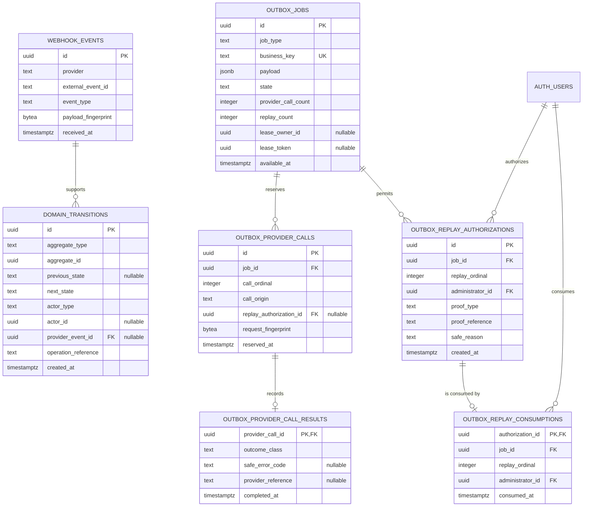
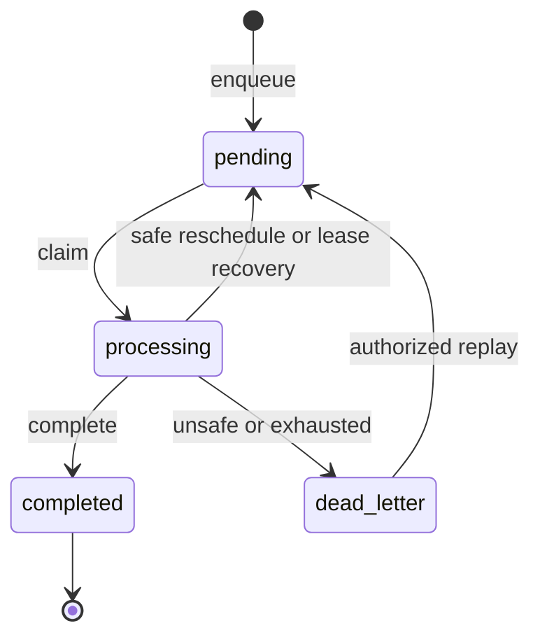

---
tags:
  - RPRT
  - database
  - reliability
  - audit
  - outbox
  - webhooks
  - RLS
  - schema
  - reference
type: schema-reference
---
[[Studio Repertório]]
[[Database Schemas]]
[[Administrator Membership Schema]]
[[RPRT-43 - Provider Call Counting and Lease Contract]]
[[RPRT-52 - Reliability and Audit Foundation Plan]]
[[PR13 Quick Guide|PR #13 Quick Guide]]

# Reliability and Audit Schema

> [!abstract] Reliability Schema
> The database stores immutable provider evidence, domain transitions, operational alerts, durable outbox work, provider-call evidence, and protected replay evidence.

> [!warning] Source Of Truth
> The repository migrations and pgTAP tests are authoritative.

## Schema Boundary

| Table | Purpose |
|---|---|
| `webhook_events` | Deduplicated provider-event identity and payload fingerprint |
| `domain_transitions` | Append-only business and outbox state evidence |
| `operational_alerts` | Append-only operational alert evidence |
| `outbox_jobs` | Durable work state, payload, policy snapshot, counters, and lease |
| `outbox_provider_calls` | One immutable reservation before each provider dispatch |
| `outbox_provider_call_results` | Zero or one immutable result for each reserved call |
| `outbox_replay_authorizations` | Administrator proof for one protected replay |
| `outbox_replay_consumptions` | One-time consumption of replay authorization |

## Relationship Model

## Immutable Evidence

### Webhook Events

`webhook_events` stores provider identity and a 32-byte payload fingerprint, not the raw payload. `(provider, external_event_id)` is unique. Identical repeated evidence returns the existing row; conflicting duplicate evidence fails.

### Domain Transitions

`domain_transitions` records aggregate identity, previous and next state, actor, source, reason, optional webhook evidence, operation reference, and database time. `aggregate_id` is polymorphic and does not have a foreign key.

### Operational Alerts

`operational_alerts` records alert type, aggregate identity, reason, operation reference, and database time. Dead-letter paths create an `outbox_dead_letter` alert.

All three evidence tables reject updates and deletes.

## Outbox Jobs

`outbox_jobs` keeps current execution state and immutable execution policy in one row.

| Field group | Main columns | Rule |
|---|---|---|
| Identity | `id`, `job_type`, `business_key` | Database UUID and globally unique business key |
| Request | `payload`, `payload_version`, `request_fingerprint` | Exact approved JSON shape; fingerprint becomes immutable after first dispatch |
| State | `state`, `available_at`, `created_at`, `updated_at` | `pending`, `processing`, `completed`, or `dead_letter` |
| Budget | `provider_call_count`, `replay_count`, call limits | Counters never reset and cannot exceed stored limits |
| Policy | Timeouts, backoff, jitter, idempotency window, lease duration | Complete immutable policy snapshot copied at enqueue time |
| Lease | Owner, token, claim time, expiry | All lease fields are present together only while processing |
| Replay | `active_replay_authorization_id` | Binds a consumed proof to the next replay dispatch |

Important constraints:

- `business_key` is trimmed, globally unique, and at most 256 characters.
- `processing` requires a complete unexpired lease identity.
- Non-processing states have no lease.
- `completed` is terminal.
- Job identity, payload, policy, and creation time are immutable.
- Application roles have no delete path.

## Provider Calls And Replay

Each `outbox_provider_calls` row is created before dispatch and uses a positive `call_ordinal`. The schema permits only one provider call per claim and one replay call per replay authorization.

Each provider call has zero or one `outbox_provider_call_results` row. Allowed outcome classes are:

- `success`
- `provider_failure`
- `connection_failure`
- `total_timeout`
- `lost_response`
- `post_dispatch_worker_failure`

Replay uses two immutable records:

1. `outbox_replay_authorizations` stores administrator proof and the next replay ordinal.
2. `outbox_replay_consumptions` proves one-time use of that authorization.

Foreign keys bind the authorization, consumption, job, replay ordinal, administrator, and replay provider call to the same evidence chain.

## Lifecycle

- Claiming a job does not consume a provider call.
- Reserving a provider call increments the call count before dispatch.
- A safe failure can reschedule with bounded policy backoff.
- Unsafe, ambiguous, or exhausted work becomes `dead_letter`.
- Protected replay requires administrator authorization and one-time consumption.
- Replay keeps the same job and cumulative counters.

## Command Boundary

| Function group | Main functions | Actor |
|---|---|---|
| Webhook evidence | `record_webhook_event` | `service_role` |
| Enqueue | `enqueue_outbox_job` | `service_role` |
| Worker claim and dispatch | `claim_outbox_jobs`, `reserve_outbox_provider_call` | `service_role` |
| Completion and failure | `complete_outbox_job`, `reschedule_outbox_job`, `dead_letter_outbox_job` | `service_role` |
| Lease recovery | `recover_expired_outbox_job` | `service_role` |
| Protected replay | `authorize_outbox_replay`, `replay_outbox_job` | Authenticated administrator |

All subsystem tables have RLS enabled and no application-role policies. Direct table privileges are revoked from `PUBLIC`, `anon`, `authenticated`, and `service_role`. Access occurs through narrow `security definer` functions with fixed empty `search_path` values.

## Repository Sources

- `supabase/migrations/20260818215648_add_immutable_reliability_evidence.sql`
- `supabase/migrations/20260818220114_add_policy_based_outbox_enqueue.sql`
- `supabase/migrations/20260818220811_add_outbox_claim_and_call_reservation.sql`
- `supabase/migrations/20260818223049_add_outbox_completion_and_dead_letter_controls.sql`
- `supabase/migrations/20260818224616_add_protected_outbox_replay.sql`
- `supabase/tests/reliability_evidence.test.sql`
- `supabase/tests/outbox_enqueue.test.sql`
- `supabase/tests/outbox_worker_commands.test.sql`
- `supabase/tests/outbox_completion.test.sql`
- `supabase/tests/outbox_failure_commands.test.sql`
- `supabase/tests/outbox_lease_recovery.test.sql`
- `supabase/tests/outbox_replay.test.sql`

> [!summary] Core Rule
> External effects use durable jobs and immutable evidence. Protected database commands control every state change, call reservation, and replay.
