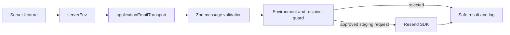

---
aliases:
  - Resend Project Structure
  - RPRT Resend Initialization
tags:
  - RPRT
  - software-development
  - resend
  - email
  - integration
  - reference
type: implementation-reference
status: implemented
issue: RPRT-62
pull-request: https://github.com/guisaliba/repertorio/pull/25
updated: 2026-08-31
---
# Resend Project Initialization

> [!abstract] Studio Repertório Email Foundation
> This note explains how [[Studio Repertório]] initializes Resend for application transactional email and hosted Supabase Auth SMTP. It shows the minimum project structure, the server-only boundary, environment rules, safe result contract, and test layout implemented by RPRT-62.

**Related notes:** [[Resend|Resend Operations Reference]] · [[Software Delevopment|Software Development]] · [[Reliability and Audit Schema]]

> [!important] Two Separate Paths
> Supabase Auth sends recovery and authentication messages through hosted SMTP configuration. Application code sends transactional messages through `src/lib/email/resend.ts`. Do not combine their credentials or runtime boundaries.

---

## <span style="color:#80352F">Current Boundary</span>

The M1 implementation proves a controlled sandbox transport. It does not enable production sending.

| Path | Owner | Current State |
|---|---|---|
| Supabase Auth email | Hosted Supabase Auth SMTP settings | Sandbox delivery proven |
| Application transactional email | `src/lib/email/resend.ts` | Server-only sandbox transport implemented |
| Templates and message composition | M5-M6 application work | Not implemented |
| Durable dispatch and retries | Later outbox worker | Database policy exists; runtime worker not implemented |
| Production domain and senders | RPRT-67 | Blocked pending owned-domain proof |

## <span style="color:rgb(0, 112, 192)">Request Flow</span>



The caller supplies message content and one stable idempotency key. The transport owns the sender, environment gate, sandbox recipient allowlist, provider call, error classification, and safe logging.

## <span style="color:rgb(112, 48, 160)">Project File Map</span>

| File | Responsibility |
|---|---|
| `.env.example` | Documents the variable name without a real secret |
| `src/lib/env/server.ts` | Reads `RESEND_API_KEY` only on the server |
| `src/lib/env/deployment.mts` | Validates key shape and environment ownership |
| `scripts/verify-preview-environment.mjs` | Rejects the key before a Preview build can read it |
| `src/lib/email/resend.ts` | Implements the narrow application transport |
| `src/lib/email/resend.unit.test.ts` | Proves guards, results, provider mapping, and safe logs without network calls |
| `src/lib/email/resend.contract.test.ts` | Runs approved, opt-in staging provider checks |
| `vitest.resend.config.mts` | Isolates the live contract suite from normal tests |
| `docs/email.md` | Defines the complete project transport contract and evidence |

## <span style="color:rgb(0, 176, 80)">Initialization Sequence</span>

### 1. Install the server SDK

The project pins the SDK through `package.json` and `pnpm-lock.yaml`.

```bash
pnpm add resend
```

Do not call the Resend API from browser code. The API key and provider SDK belong behind a server boundary.

### 2. Declare the server secret name

```env
RESEND_API_KEY=re_your_staging_key
```

`.env.example` contains a placeholder only. Never store the real key in Git, Obsidian, logs, screenshots, test fixtures, or client variables.

### 3. Read and validate server environment input

`src/lib/env/server.ts` reads the process variable and passes it to the shared deployment resolver:

```ts
export const serverEnv = resolveDeploymentEnvironment(
  {
    ...clientEnv,
    APP_ENVIRONMENT: process.env.APP_ENVIRONMENT,
    RESEND_API_KEY: process.env.RESEND_API_KEY,
  },
  deploymentPolicy,
);
```

The deployment schema requires an `re_` prefix. Environment policy then decides whether the key is optional, required, or forbidden.

| Application Identity | Key Rule  | Transport Rule                                                   |
| -------------------- | --------- | ---------------------------------------------------------------- |
| `local`              | Optional  | Normal local development uses Supabase email capture, not Resend |
| `preview`            | Forbidden | Application sending is denied before build and at runtime        |
| `staging`            | Required  | Controlled sandbox sending is allowed                            |
| `production`         | Forbidden | Production waits for RPRT-67                                     |

### 4. Create one narrow server-only transport

The module starts with a hard server boundary:

```ts
import "server-only";

import { Resend } from "resend";
```

The input contract is intentionally small:

```ts
export interface TransactionalEmail {
  recipient: string;
  subject: string;
  html: string;
  text: string;
  idempotencyKey: string;
}
```

The caller cannot set `from`, CC, BCC, reply-to, attachments, scheduling, tags, provider headers, or retry behavior.

### 5. Initialize the application transport once

```ts
export const applicationEmailTransport = createResendEmailTransport({
  environment: serverEnv.environment,
  apiKey: serverEnv.RESEND_API_KEY,
});
```

This export binds the validated application identity and server secret to the transport. Feature code imports this ready transport instead of creating provider clients with unvalidated process variables.

### 6. Send from a server-owned feature

```ts
const result = await applicationEmailTransport.send({
  recipient: "delivered@resend.dev",
  subject: "Order received",
  html: "<p>We received your order.</p>",
  text: "We received your order.",
  idempotencyKey: `order-confirmation-email/${orderId}`,
});

if (result.status === "failed") {
  // Give failureClass and safeErrorCode to the owning durable workflow.
}
```

The idempotency key identifies one logical email. A later safe retry must use the same key and unchanged payload within Resend's 24-hour idempotency window.

> [!warning] Current Sandbox Only
> The example uses a Resend synthetic recipient. The M1 transport rejects ordinary customer recipients before provider access.

## <span style="color:rgb(255, 140, 0)">Sandbox Guard</span>

The transport fixes the sender:

```text
Studio Repertório <onboarding@resend.dev>
```

It accepts only:

- The approved Resend account inbox.
- `delivered@resend.dev`, `bounced@resend.dev`, and `complained@resend.dev`.
- Their approved `+rprt62-<run-id>` variants.
- Exact `suppressed@resend.dev` without a label.

Every other recipient returns `resend_recipient_not_allowed` before the SDK runs.

## <span style="color:rgb(192, 0, 0)">Safe Result Contract</span>

The transport converts provider details into a small application result:

| Result | Meaning | Automatic Transport Retry |
|---|---|:---:|
| `accepted` | Resend accepted one message and returned a provider ID | No |
| `transient` | Rate limit, concurrent idempotent request, or provider availability failure | Deferred to outbox policy |
| `permanent` | Configuration, validation, authentication, quota, domain, recipient, or idempotency conflict | No |
| `unexpected` | Exception, missing status, or malformed provider response | Fail closed |

The Node.js SDK normally returns `{ data, error }`; the transport validates both shapes. It also catches thrown transport exceptions without exposing private provider messages.

Safe completion logs can contain:

- Event name and provider.
- Application environment.
- Accepted or failed status.
- Failure class and stable safe code.
- Accepted provider message ID.

Logs must not contain the recipient, sender, subject, body, idempotency key, API key, raw provider message, or headers.

## <span style="color:rgb(0, 176, 240)">Supabase Auth SMTP Initialization</span>

Hosted staging Supabase Auth uses a separate Resend SMTP credential:

| Setting | Value |
|---|---|
| Host | `smtp.resend.com` |
| Port | `465` |
| Username | `resend` |
| Password | Approved SMTP key stored only in hosted Supabase Auth settings |
| Sender name | `Studio Repertório` |
| Sender email | `onboarding@resend.dev` |

Do not put the Auth SMTP password in application environment files. The shared sandbox sender proved delivery but used a tracking intermediary. Production Auth email remains blocked until RPRT-67 proves the owned sender with tracking disabled.

## <span style="color:rgb(255, 192, 0)">Verification Structure</span>

### Network-free default tests

```bash
pnpm test:unit
pnpm typecheck
pnpm verify:client-bundle
```

Unit tests inject a narrow `send` dependency. They prove behavior without calling Resend and confirm that provider input, errors, and logs do not leak private data.

### Explicit live contract test

```bash
RPRT62_LIVE_SEND_APPROVED=true \
RPRT62_RUN_ID=<unique-lowercase-run-id> \
RESEND_API_KEY=<approved-staging-key> \
NEXT_PUBLIC_SUPABASE_URL=<approved-staging-url> \
NEXT_PUBLIC_SUPABASE_PUBLISHABLE_KEY=<approved-publishable-key> \
pnpm test:resend:contract
```

> [!danger] Approval and Quota
> This command sends real sandbox requests and consumes provider quota. Run it only with explicit approval. It does not load `.env` files and validates the exact staging project before network access.

## <span style="color:rgb(112, 48, 160)">Next Structure</span>

M1 supplies the transport boundary, not the complete email system.

1. M5-M6 add approved transactional templates and feature-owned message composition.
2. The outbox worker reserves provider calls and owns retries, delay, and lifetime-call ceilings.
3. Webhook handlers verify signatures before they classify delivery, bounce, complaint, and suppression events.
4. Suppression state prevents unsafe future sends.
5. RPRT-67 adds the production domain, final senders, separate credentials, and tracking-free Auth-link proof.

See [[Reliability and Audit Schema]] for the durable outbox and provider-call evidence foundation.

## <span style="color:#80352F">Source of Truth</span>

- [`src/lib/email/resend.ts`](https://github.com/guisaliba/repertorio/blob/dev/src/lib/email/resend.ts)
- [`src/lib/email/resend.unit.test.ts`](https://github.com/guisaliba/repertorio/blob/dev/src/lib/email/resend.unit.test.ts)
- [`src/lib/email/resend.contract.test.ts`](https://github.com/guisaliba/repertorio/blob/dev/src/lib/email/resend.contract.test.ts)
- [`docs/email.md`](https://github.com/guisaliba/repertorio/blob/dev/docs/email.md)
- [RPRT-62](https://linear.app/guisaliba/issue/RPRT-62/configure-the-resend-transport-baseline)
- [PR #25](https://github.com/guisaliba/repertorio/pull/25)
- [[Resend|General Resend setup, operations, and provider safety reference]]

> [!note] Authority
> Repository code and `docs/email.md` are authoritative for Studio Repertório behavior. The general [[Resend]] note supplies provider-wide guidance.
