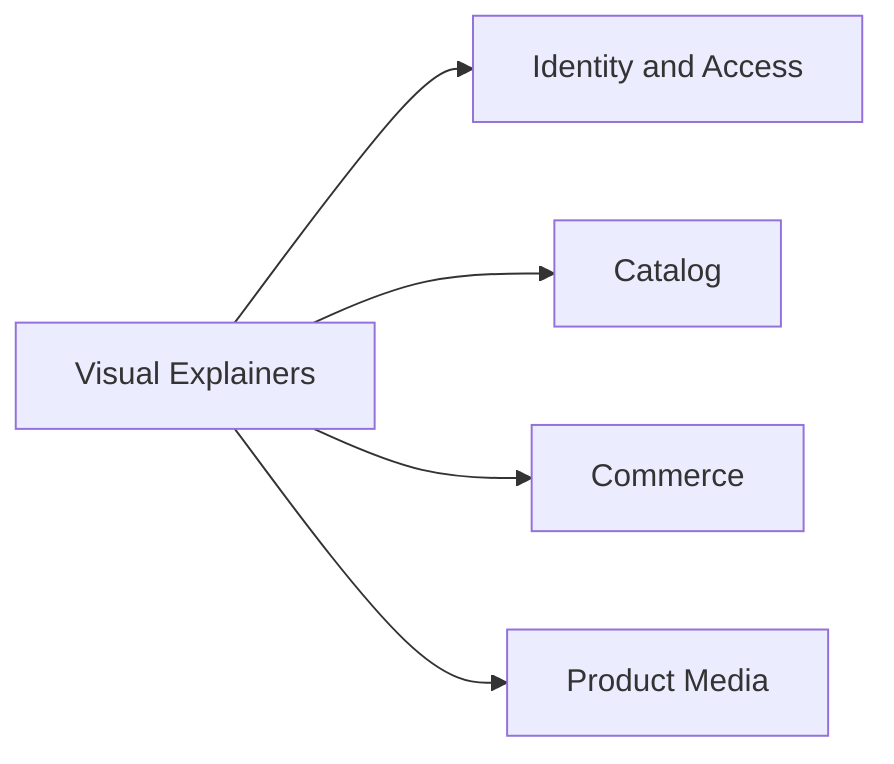

---
aliases:
  - RPRT Visual Explainers
  - Visual Explainer Index
tags:
  - RPRT
  - visual-explainer
  - index
type: visual-index
---
[[Studio Repertório|Back to Studio Repertório]]

# Visual Explainers

> [!abstract] Visual Library
> A central index of the self-contained HTML visual explainers stored inside the Repertório Obsidian vault.

> [!info] Local Copies
> Every link below opens a physical HTML file in `RPRT/Visual Explainers/`. These copies do not depend on the Linear attachment URL.

---

## Visual Map

## Identity And Access

> [!example] Identity Schema
> [[Visual Explainers/RPRT-47 Identity Schema Visual Explainer.html|Open the identity schema visual explainer]]

| Related note | Coverage |
|---|---|
| [[Auth Users and Profiles]] | Auth identity, profiles, addresses, RLS, and account initialization |

## Catalog

> [!example] Catalog Authority
> [[Visual Explainers/RPRT-50 Catalog Authority Visual Explainer.html|Open the catalog authority visual explainer]]

| Related note | Coverage |
|---|---|
| [[Catalog Products Categories and Archival]] | Categories, products, media relations, merchandising, visibility, and guarded state |

## Commerce

> [!example] Cart, Quote, And Coupons
> [[Visual Explainers/RPRT-49 Cart Quote Coupon Visual Explainer.html|Open the commerce schema visual explainer]]

| Related note | Coverage |
|---|---|
| [[Cart, Quote and Coupons Security]] | Cart ownership, protected shipping evidence, coupons, lock order, and consumption |

## Product Media

> [!example] Storage Security
> [[Visual Explainers/RPRT-10 Product Media Storage Visual Explainer.html|Open the product media Storage visual explainer]]

| Related note | Coverage |
|---|---|
| [[Product Media Storage]] | Bucket rules, object identity, MIME validation, actor access, and public delivery |

---

## Complete File Index

| Domain | Local HTML file |
|---|---|
| Identity and access | [[Visual Explainers/RPRT-47 Identity Schema Visual Explainer.html]] |
| Catalog | [[Visual Explainers/RPRT-50 Catalog Authority Visual Explainer.html]] |
| Commerce | [[Visual Explainers/RPRT-49 Cart Quote Coupon Visual Explainer.html]] |
| Product media | [[Visual Explainers/RPRT-10 Product Media Storage Visual Explainer.html]] |

> [!quote] Library Rule
> Add each new physical HTML explainer to this index and link it from its related reference note.
