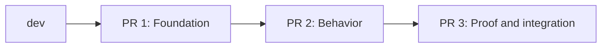

---
aliases:
  - Stacked PRs
tags:
  - software-development
  - git
  - github
  - code-review
  - stacked-prs
  - RPRT
  - reference
type: development-reference
status: active
source: https://mainbranch.dev/articles/stacked-prs-judgment/
updated: 2026-08-31
---
# Stacked Pull Requests

> [!abstract] One Review Decision Per Pull Request
> A stacked pull request is one layer in an ordered set of dependent changes. A useful stack gives each layer one clear review question, keeps dependency order explicit, and lets feedback reach foundations before higher work becomes difficult to change.

**Related hubs:** [[Software Delevopment|Software Development]] · [[RPRT/Studio Repertório|Studio Repertório]]

> [!quote] Core Judgment
> Split work where the review decisions split, not at an arbitrary line count.

---

## <span style="color:#80352F">Mental Model</span>

A normal pull request compares one branch with its base. A stack connects several reviewable branches in dependency order.



Each layer answers one question:

| Layer | Reviewer Decision | Safe Result |
|---|---|---|
| Foundation | Is the contract or infrastructure correct? | Can merge alone or remain safely inactive. |
| Behavior | Does the feature use the lower contract correctly? | Depends only on reviewed lower layers. |
| Proof | Do tests and integration prove the behavior? | Makes the complete stack verifiable. |

> [!important] A Stack Must Earn Its Branches
> Extra branches are useful only when the dependency order gives reviewers separate, meaningful decisions.

## <span style="color:rgb(0, 112, 192)">The Four-Question Test</span>

Create a stack when the answers are **yes**:

1. Can the lower layer merge safely by itself or behind an approved inactive boundary?
2. Can feedback on the lower layer reshape the work above it?
3. Can a reviewer assess this layer without reconstructing the complete feature?
4. Does branch order match the real implementation dependency?

If the answer is no, keep the related behavior together.

<table style="width:100%; border-collapse:separate; border-spacing:0 8px; margin:8px 0 16px;">
<colgroup><col style="width:50%;"><col style="width:50%;"></colgroup>
<thead><tr><th style="padding:8px; border-bottom:1px solid #d0d7de; text-align:left; color:rgb(0,176,80);">Good Split</th><th style="padding:8px; border-bottom:1px solid #d0d7de; text-align:left; color:rgb(192,0,0);">False Split</th></tr></thead>
<tbody>
<tr><td style="padding:9px 10px; border:1px solid #e6e8eb; border-radius:6px;">Schema and contract first; API behavior second.</td><td style="padding:9px 10px; border:1px solid #e6e8eb; border-radius:6px;">Rename split only to reduce line count.</td></tr>
<tr><td style="padding:9px 10px; border:1px solid #e6e8eb; border-radius:6px;">Test signal first; product behavior second.</td><td style="padding:9px 10px; border:1px solid #e6e8eb; border-radius:6px;">UI separated from the API required to judge it.</td></tr>
<tr><td style="padding:9px 10px; border:1px solid #e6e8eb; border-radius:6px;">Shared contract first; consumer integration second.</td><td style="padding:9px 10px; border:1px solid #e6e8eb; border-radius:6px;">Branches added only to make a tidy diagram.</td></tr>
</tbody>
</table>

## <span style="color:rgb(0, 176, 80)">Review Shape</span>

Line count is a warning signal, not the primary split rule.

- A 600-line mechanical rename can be one coherent review decision.
- A 120-line change across authentication, persistence, and interface behavior can contain three decisions.
- A pull request becomes difficult when a reviewer must understand too many unrelated contracts before giving useful feedback.
- Open the bottom layer early because changes there cascade through every higher branch.

> [!tip] Practical Default
> Start with two layers. Add another layer only when it gives the reviewer a separate useful question. At four or five layers, inspect the work again: the feature might contain too many decisions and need a smaller issue.

## <span style="color:rgb(112, 48, 160)">Studio Repertório Adaptation</span>

For [[RPRT/Studio Repertório|Studio Repertório]], use stack layers as delivery and evidence boundaries:

| Order | Typical Scope | Review Question |
|---:|---|---|
| 1 | Schema, contract, or shared foundation | Is the durable boundary correct and safe to merge? |
| 2 | Application or provider behavior | Does behavior respect the approved boundary? |
| 3 | Integration, visual evidence, or rollout | Is the full behavior proven and ready to operate? |

Project rules require a large issue to use **at least two and at most five pull requests**. If more than five review decisions are necessary, split the issue before implementation.

Each layer must:

- Be independently understandable and verifiable.
- Keep its tests and documentation with the decision they prove.
- Depend only on the same layer or a lower layer.
- Be safe to merge alone or safely inactive behind an approved boundary.
- State stack order, dependency, review question, and verification scope.

## <span style="color:rgb(255, 140, 0)">Costs and Risks</span>

> [!warning] Checks Multiply
> Each pull request can run a complete CI suite. A five-layer stack can consume approximately five times the CI work of one pull request unless workflows use stack position deliberately.

- A stalled foundation blocks every higher layer.
- A lower-layer change can require rebases and conflict resolution above it.
- Reviewers can lose context when PR descriptions do not show stack order.
- A stack can hide complete behavior if layers are too small or cannot be judged alone.
- More branches do not repair unclear requirements or weak tests.

GitHub exposes stack position and size to workflows:

```yaml
${{ github.event.pull_request.stack.position }}
${{ github.event.pull_request.stack.size }}
```

Use fast required checks on every layer. Reserve expensive complete-suite work for an approved stack position only when repository policy permits it.

## <span style="color:rgb(0, 176, 240)">Native GitHub Workflow</span>

```bash
gh extension install github/gh-stack
gh stack init
gh stack add <branch>
gh stack submit
```

The bottom pull request targets the trunk branch. Each higher pull request targets the branch directly below it. Merge in dependency order unless the approved stack operation safely merges the connected range.

## <span style="color:rgb(255, 192, 0)">Author Checklist</span>

- [ ] Name the one decision this pull request asks the reviewer to make.
- [ ] Confirm the layer can merge safely or remain safely inactive.
- [ ] Put every dependency in this layer or a lower layer.
- [ ] Include the tests and documentation that prove this layer.
- [ ] Open the bottom layer before higher work becomes rigid.
- [ ] Show stack order and branch targets in every description.
- [ ] Keep required checks green on every layer.
- [ ] Account for multiplied CI cost.
- [ ] Merge from the bottom upward or use the approved connected-stack operation.

## <span style="color:#80352F">Decision Rule</span>

> [!success] Use a Stack When
> The work has an explainable dependency order and each layer gives a reviewer one independent, useful decision.

> [!failure] Keep One Pull Request When
> Separating the files would hide the behavior the reviewer must assess, or when the layers cannot merge safely by themselves.

## <span style="color:rgb(0, 112, 192)">Reference</span>

- Andrea Griffiths, [Give each pull request in a stack one review decision](https://mainbranch.dev/articles/stacked-prs-judgment/), Main Branch, July 29, 2026; updated August 8, 2026.
- [Official GitHub stacked pull request walkthrough](https://gh.io/stacks)

> [!note] Source Boundary
> The article supplies the judgment model, tradeoffs, native workflow, and CI-cost warning. The Studio Repertório section applies the project's local delivery rules to that model.
